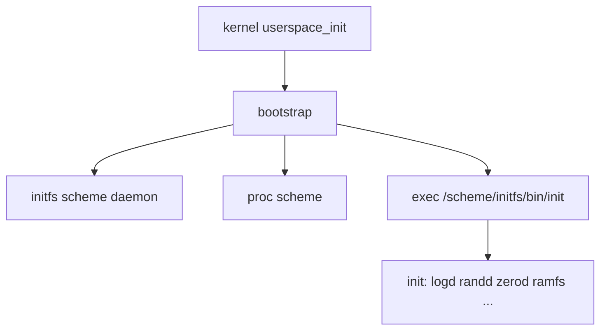
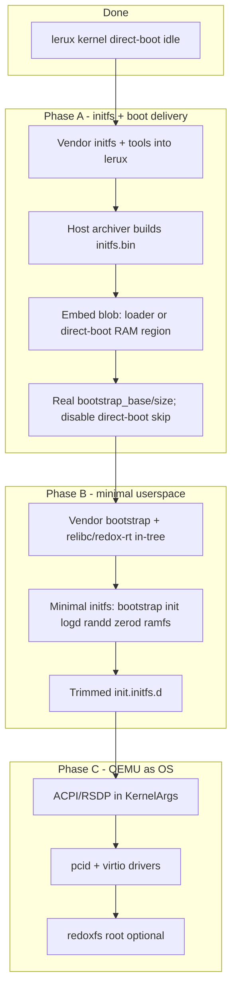

# PLAN.md — lerux (Only Rust Redox) Development Roadmap

This document collects all potential next steps, ideas, and open questions that have been discussed during development. It serves as a living backlog.

Last updated: 2026-05-30 (Only Rust policy recorded; Phase B userspace milestone)

---

## Project principles

### Only Rust (policy)

**Goal:** From CPU reset through every userspace process, only instructions that come from Rust (via the normal Rust toolchain) may execute on lerux. Host build/CI scripts (`just`, shell smoke tests) are fine when they do not run on the machine.

This section records decisions from the 2026-05-30 design review. Use it as the acceptance criteria for “Only Rust” work; see [Only Rust enforcement](#only-rust-enforcement) and [Only Rust migration sequence](#only-rust-migration-sequence).

#### Scope

| In scope | Out of scope |
|----------|----------------|
| Kernel, boot stubs, bootloader (when shipped), every initfs ELF | Host-only recipes, CI, reference trees (`../tryredox/`) |

#### Userspace runtime

- **Replace relibc** — no C runtime in shipped ELFs; remove `vendor/relibc/` when nothing references it.
- **`#![no_std]` + in-tree runtime** — fork/evolve `redox-rt` / `generic-rt` into lerux-owned crates (e.g. `userspace/runtime/`).
- Drop the workspace **`libc`** dependency on init/daemons; use **`redox_syscall`** and **`libredox`** where needed.
- **Static linking only** — no foreign dynamic linker; no `.toolchain/` relibc tarball long term.

#### Executables

- **Lerux ELFs only** — only binaries built in this repo against the lerux runtime. No ported Redox/C `pkg` binaries; upstream Redox artifacts are read-only references, not runtime dependencies.

#### Low-level CPU code

- **Rust-authored only** in kernel and userspace: `global_asm!`, `asm!`, `#[naked]` in `.rs` are allowed.
- **Not allowed** long term: standalone `.S` / `.asm`, NASM, `include_bytes!` of machine code that was not produced by `rustc`/LLVM in this build.
- **Debt:** SMP trampoline golden `.bin` files (from NASM validation); rewrite in Rust before calling scope A done for the kernel.

#### Boot chain

- **Now:** **direct-boot** + embedded initfs is the product boot path (`just qemu-direct-userspace`).
- **Before installable image:** add a lerux-owned **Rust bootloader** (UEFI/multiboot or equivalent).
- **Temporary:** `qemu/loader.S` and related asm are dev/quarantine only — not part of the lerux OS artifact story; remove after the Rust bootloader lands (see boot chain above).

#### Kernel / userspace ABI

- **Redox-compatible boot path, lerux extensions** — keep `redox_syscall`, scheme paths, initfs layout (`RedoxFtw`, entry at offset `0x1a`), and `KernelArgs` for upstream kernel merges.
- Add lerux-specific syscalls/schemes only when needed; document in `VENDORED.md` / ADRs.

#### Rust target triple

- **Phase 1:** `x86_64-unknown-redox` while porting init and daemons off `.toolchain/` relibc onto the in-tree runtime.
- **Phase 2:** `x86_64-unknown-lerux` (custom target JSON in-repo) once the in-tree runtime is the sole sysroot.

#### Only Rust enforcement

CI and local checks should prove the policy, not only smoke serial output:

| Check | Purpose |
|-------|---------|
| **Smoke** | `just smoke` / `just smoke-userspace` — boot path still works |
| **ELF audit** | Every initfs ELF: no `NEEDED` on relibc/libc; static lerux runtime only |
| **Source policy** | Fail on new `*.c`, `*.S`, `*.asm` under `kernel/`, `userspace/`, `vendor/` except a shrinking allowlist |
| **Trampolines** | `just validate-trampolines` until NASM golden path is removed |

Target recipe: **`just check-only-rust`** (or a dedicated CI job) implementing the above. Allowlist until deleted: `vendor/relibc/`, `qemu/*.S`, trampoline validation asm under `kernel/validation/trampolines/asm/`.

#### Only Rust migration sequence

1. Fork **`redox-rt` / `generic-rt`** → `userspace/runtime/`; bootstrap uses only that.
2. Port **`init`** + early daemons off `libc` / `.toolchain` relibc onto the runtime.
3. Turn on **enforcement gates** (allowlist shrinks as debt is removed).
4. Remove **`vendor/relibc/`** and relibc tarball download from `just`.
5. SMP trampolines → Rust **`global_asm!`**; drop NASM golden embed path.
6. Introduce **`x86_64-unknown-lerux`** target (custom JSON + in-tree sysroot).
7. Rust **bootloader** + installable image.
8. Delete or quarantine **`qemu/loader.S`** boot asm.

#### Only Rust definition of done

- Direct-boot userspace smoke passes.
- Initfs ELFs pass enforcement (no relibc; lerux runtime only).
- Kernel has no non–Rust-authored executing machine code on the boot/SMP path.
- `vendor/relibc/` removed; dev loop does not download the relibc toolchain tarball.

#### Only Rust current debt

| Item | Violates | Notes |
|------|----------|-------|
| `init` + daemons via **`libc`** + `.toolchain/` relibc | Runtime / executables | Phase B bridge |
| `vendor/relibc/` + bootstrap **`redox-rt`** path | Runtime | Bootstrap closest to target |
| SMP trampoline **`.bin`** from NASM | CPU code | Use `just validate-trampolines` until Rust rewrite |
| **`qemu/loader.S`**, MBR stub | Boot chain | Not the product path; remove with Rust bootloader |
| PVH stub in **`pvh_boot.rs`** | — | Aligned (Rust `global_asm!`) |

### Vendor everything (no live Redox repo dependencies)

**All code and libraries used by lerux must live in this repository (or explicit git submodules under lerux control).** Do not rely on:

- Git dependencies pointing at `gitlab.redox-os.org` or other Redox remotes at build time
- The full upstream Redox `make install` / sysroot as the primary development loop
- `redoxer` or other tools that pull moving targets from external Redox trees unless vendored and pinned

When adopting components from upstream Redox (e.g. the reference tree under `tryredox/base`), **copy them into lerux** (e.g. `userspace/`, `vendor/`) and:

- Replace `path = "../…"` and `git = "https://gitlab.redox-os.org/…"` with **in-tree paths**
- Pin versions in the lerux workspace; document provenance in [VENDORED.md](VENDORED.md)
- Track intentional divergences for "Only Rust" or lerux-specific boot paths

Upstream Redox repos remain useful as **read-only references** for design and occasional merges—not as runtime build dependencies.

### Development style

- Prefer **`just` / `cargo`** for day-to-day kernel and (eventually) userspace builds
- Use **`NOTES.md`** for verified boot/debug facts; use **this file** for backlog and strategy

---

## Current state (kernel + Phase B userspace)

| Layer | Status |
|--------|--------|
| Kernel | Vendored under `kernel/`; direct-boot reaches `kmain` idle loop (`just qemu-direct`) |
| Boot handoff | PVH stub (pure Rust), synthetic `KernelArgs` in `direct-boot` mode |
| Initfs | Vendored archiver + staging; `build/initfs.bin` embedded in kernel |
| Userspace | **Phase B milestone:** `just build-direct-userspace` + `just smoke-userspace` — bootstrap → init → early daemons (`init: switchroot to /scheme/initfs`) |
| Kernel-only smoke | `just smoke` — asserts idle marker: `direct-boot mode: skipping userspace bootstrap` |
| Userspace smoke | `just smoke-userspace` — asserts `init: switchroot to /scheme/initfs` (set `USERSPACE_SMOKE=1`) |

See `NOTES.md` for serial output, GDB breakpoints, and paging/bootstrap fixes.

### Kernel ↔ userspace contract (for later phases)

The kernel expects a contiguous physical **bootstrap/initfs** blob. The first userspace entry point is read from **offset `0x1a`** in the initfs header (`RedoxFtw` magic; see vendored `initfs` types and `kernel/src/syscall/process.rs`).

`KernelArgs` fields: `bootstrap_base`, `bootstrap_size` (see `kernel/src/startup/mod.rs`). Full Redox boot loaders place this blob in RAM; lerux must do the same once userspace is enabled.

---

## Reference: `tryredox` (upstream layout, not a dependency)

The sibling directory `../tryredox/` holds local clones for study and copying into lerux. It is **not** part of lerux and must not be required to build lerux.

- **`tryredox/base`** — daemons, drivers, bootstrap, initfs, init (primary source for userspace Phases A–B).
- **Full GitLab gap analysis** — what `tryredox` has vs missing repos (Tiers 1–5), boot diagram, and lerux implications: [VENDORED.md § Reference tree: tryredox](VENDORED.md#reference-tree-tryredox-vs-gitlabredox-osorgredox-os).

Summary: `tryredox` already has **kernel, base, relibc, syscall, redoxfs, redox, redoxer, orbital, acid, book, uefi** (~11 git repos). It is **missing Tier 1** boot/image pieces (**bootloader**, **ion**, **coreutils**, **pkgutils**, **net** utils, **binutils**, …) and **Tier 2** git deps of `base` (**acpi**, **redox-log**, **orbclient**, …). See VENDORED.md for the complete tier tables.

### What `base` contains (high level)

| Component | Role |
|-----------|------|
| **`initfs`** | `no_std` reader for the in-RAM initfs image (`RedoxFtw`, inodes) |
| **`initfs/tools`** | Host tool `redox-initfs-ar`: directory + bootstrap ELF → image file |
| **`bootstrap`** | First userspace process: remaps self, spawns initfs/proc schemes, execs `init` |
| **`init`** | Service manager; reads `init.initfs.d` / `init.d` unit files |
| **`logd`**, **`zerod`**, **`randd`**, **`ramfs`** | Small scheme daemons (good minimal set) |
| **`daemon`**, **`scheme-utils`** | Boilerplate for scheme daemons |
| **`drivers/*`** | PCI, VirtIO, ACPI, block, net, graphics, USB, … |
| **`netstack`**, **`ipcd`**, **`ptyd`**, … | Full OS features (defer) |

`bootstrap` is **excluded** from the base workspace upstream (separate `Cargo.toml`); lerux should treat it as its own crate when vendored.

### Reuse priority (what to vendor into lerux, in order)

1. **`initfs` + `initfs/tools`** — Format and host archiver; answers "minimal bootstrap/initfs region". Round-trip tests like `archive_and_read.rs` are good CI candidates.
2. **`bootstrap`** — Do not rewrite; vendor and build for `*-unknown-redox` (or lerux's userspace target). Bridges `userspace_init` / `usermode_bootstrap` in the kernel.
3. **Minimal initfs contents + trimmed service graph** — `init` plus a **subset** of `init.initfs.d` (not the full graphics/storage/USB graph).
4. **`daemon` / `scheme-utils`** — Patterns for any new lerux-specific daemons.
5. **Drivers** — Only after init runs: `pcid`, `pcid-spawner`, `virtio-core`, `virtio-blkd`, `virtio-netd`, ACPI/`hwd` when boot args include RSDP.

### Minimal early userspace (from base `00_runtime.target`)

Relibc/runtime expectations for a functioning early system include (names from reference `init.initfs.d`):

- `logd` (`log` scheme)
- `zerod` (`null` / `zero`)
- `randd`
- `ramfs@logging`
- `rtcd`

Then **`init`** with units trimmed to what lerux actually ships. Defer: `redoxfs` / `50_rootfs.service`, graphics (`vesad`, `fbcond`, …), `netstack`, `ipcd`, `ptyd`, USB stack.

### What **not** to vendor or enable early

- Entire `init.initfs.d` + `init.d` as-is (pulls graphics, `redoxfs`, networking before needed)
- Reimplementing initfs layout (kernel contract is fixed at header offset `0x1a`)
- Depending on upstream Redox `make install` as the main dev loop (conflicts with cargo/`just` goals)

### Bootstrap flow (reference only)

---

## Phased roadmap (kernel → userspace → OS)

### Phase A — Initfs image and boot delivery

- [x] Vendor **`initfs`** crate (reader) under lerux (e.g. `userspace/initfs/`)
- [x] Vendor **`initfs/tools`** (host archiver) under lerux (e.g. `userspace/initfs-tools/`)
- [x] Root **Cargo workspace**: kernel + host tools + (later) userspace members; keep **`bootstrap`** as separate crate like upstream
- [x] `just` / `xtask` recipe: build minimal staging dir → `initfs.bin`
- [x] Deliver blob to kernel:
  - [x] Extend **direct-boot** to map a linked-in / embedded blob (same `KernelArgs` contract)
  - [ ] Extend **QEMU loader** to place initfs at known physical address (parallel track)
- [x] Set real `bootstrap_base` / `bootstrap_size` (replace placeholder in `kernel/src/startup/direct_boot.rs`)
- [x] Smoke test: assert non-zero Bootstrap size on serial (userspace spawn still gated until Phase B bootstrap link works)

### Phase B — First living userspace

- [x] Vendor **`bootstrap`** (+ **`relibc` / `redox-rt`** snapshot) in-tree; align **`redox_syscall` 0.8.0** with kernel
- [x] Vendor **`init`** + minimal **`init.initfs.d`** + **`logd` / `zerod` / `randd` / `ramfs` / `rtcd`**
- [x] Cross-build userspace for lerux target (rust-lld + `.toolchain/` relibc; no host redox-gcc required)
- [x] Kernel: `direct-boot-userspace` feature spawns `userspace_init` (default `direct-boot` still skips for smoke tests)
- [x] Milestone: serial shows bootstrap → init → core daemons started

### Phase C — QEMU closer to full Redox

- [ ] Pass **RSDP/ACPI** (or DTB on other arches) in `KernelArgs` for direct-boot / loader
- [ ] Vendor **`drivers/pcid`**, **`pcid-spawner`**, **`virtio-core`**, **`virtio-blkd`**, **`virtio-netd`**, **`acpid`**, **`hwd`** as needed
- [ ] Optional: **`redoxfs`** + rootfs image; trim `init.d` for net/graphics when ready
- [ ] Multi-arch userspace CI when kernel paths mature

---

## 1. QEMU Bring-up & Early Boot

The current focus is getting the kernel to boot under QEMU. **Next focus after idle loop:** deliver a real initfs blob (Phase A above).

**Direct-boot (`just qemu-direct`)** is the preferred fast path: QEMU `-kernel` + PVH note + `direct-boot` feature. Verified 2026-05-29 (PR #3): boots through kernel init to the `kmain` idle loop. See `NOTES.md`.

- [ ] Make the loader reliably consume the kernel ELF placed at `0x200000` via `-device loader` (parallel track; partially implemented in the fixed-address path).
- [x] Provide a realistic, minimal memory map for direct-boot (`kernel/src/startup/direct_boot.rs`).
- [ ] Create a minimal but valid **bootstrap/initfs** region (initfs image built by vendored archiver—not tarball ad hoc; see Phase A).
- [x] Reach the first real kernel message: `"Redox OS starting..."` over serial (direct-boot).
- [x] Handle the first userspace bootstrap attempt without immediate panic — direct-boot skips userspace bootstrap by design.
- [x] Complete direct-boot through `kmain` idle loop (PR #3; see `NOTES.md`).
- [x] Improve GDB experience:
  - [x] Dedicated `qemu/debug.sh` script
  - [x] Better symbol loading (`just gdb` / `debug.sh` load `build/kernel.sym` and `set language rust`)
  - [x] Common breakpoint / watch setups documented (`NOTES.md`; pre-set in `debug.sh`)
- [ ] Add support for passing kernel command-line / environment from the loader.
- [ ] Explore using Limine as a more capable bootloader for development (vendor Limine or a fork; no live remote deps).
- [ ] Add EFI stub / UEFI boot path (longer term but valuable for real hardware).

---

## 2. "Only Rust" Purity & Architecture

See [Only Rust (policy)](#only-rust-policy) for the full spec, enforcement, and migration order.

- [x] Port the direct-boot PVH boot stub to pure Rust (`kernel/src/arch/x86_shared/pvh_boot.rs`; dropped `cc`/`clang` from `build.rs`).
- [ ] In-tree userspace runtime (`userspace/runtime/` from `redox-rt` / `generic-rt`); bootstrap + init + daemons off relibc.
- [ ] `just check-only-rust` + CI: ELF audit, source policy, smoke (see [Only Rust enforcement](#only-rust-enforcement)).
- [ ] SMP trampolines in Rust `global_asm!`; remove NASM golden / `validation/trampolines/asm/` path.
- [ ] `x86_64-unknown-lerux` target JSON after relibc removal.
- [ ] Rust bootloader before installable OS image; then remove `qemu/loader.S` / MBR stub.
- [ ] Convert the QEMU loader to pure Rust or delete it (quarantined until bootloader exists).
- [ ] Investigate removing or dramatically simplifying the custom linker scripts (`linkers/*.ld`).
- [ ] Achieve fully `cargo`-only development builds (reduce or remove reliance on the `Makefile` for day-to-day work).
- [ ] Complete SMP bring-up on riscv64 and aarch64 (currently only x86 paths have real trampoline work).
- [ ] Decide on long-term project layout:
  - Keep `kernel/` as a subdirectory forever?
  - Eventually flatten so the root crate *is* the kernel?
- [x] Root-level Cargo workspace (kernel, initfs tools, userspace members; bootstrap separate crate).
- [x] **`VENDORED.md`**: vendoring inventory plus kernel divergence baseline (pin kernel commit on next sync).
- [ ] Strategy for syncing vendored kernel/userspace vs. upstream Redox (infrequent, intentional merges—not live deps).
- [ ] Proper attribution / licensing notes for all vendored Redox-derived code.

---

## 3. Trampoline Validation & Maintenance

Interim until Rust `global_asm!` trampolines ship ([policy](#low-level-cpu-code)).

- [x] Automatic byte-for-byte comparison (`compare_trampoline_bytes.py`, `just validate-trampolines`).
- [x] Golden `.bin` files under `validation/trampolines/expected/` (embedded via `include_bytes!`).
- [x] CI job: `trampolines` in `.github/workflows/rust.yml`.
- [ ] Rewrite trampolines in Rust; drop NASM/asm validation tree.
- [ ] Per-instruction disassembly comments in generated docs (if still needed).

---

## 4. Tooling & Development Experience

- [x] Automated QEMU boot tests (`qemu/smoke-test.sh` / `just smoke`, CI `smoke` job).
- [x] Extend smoke tests for userspace milestones (bootstrap/init strings via `just smoke-userspace`).
- [x] `just` recipes: `build-direct-userspace`, `qemu-direct-userspace`, `smoke-userspace`.
- [ ] `just check-only-rust` — ELF audit + source allowlist + integrate with CI (see [Only Rust enforcement](#only-rust-enforcement)).
- [ ] Improve the root `README.md` with a proper "Getting Started" once userspace smoke works.
- [ ] Add `CONTRIBUTING.md` once the project stabilizes a bit.

---

## 5. Longer-Term / Ambitious Goals

- [x] Minimal pure-Rust userspace (bootstrap → init → core daemons; see Phases A–B).
- [ ] Full ACPI / device bring-up under QEMU (RSDP in boot args; vendored `acpid`/`hwd`).
- [ ] Graphical debug / early framebuffer support (vendored graphics stack only when needed).
- [ ] Real hardware bring-up (especially aarch64 and riscv64).
- [ ] Explore replacing more low-level pieces with pure Rust where feasible (e.g. parts of paging setup, GDT/IDT construction).
- [ ] Long-term bootloader strategy (custom minimal loader vs. vendored Limine vs. custom EFI bootloader in Rust).
- [ ] Multi-architecture CI (build + basic QEMU smoke tests for x86_64, i586, aarch64, riscv64).

---

## 6. Open Questions & Design Decisions

**Resolved (2026-05-30)** — see [Only Rust (policy)](#only-rust-policy):

- Track upstream Redox via **vendored snapshots**; keep **Redox syscall/scheme/initfs ABI**; lerux extensions only when needed.
- **No foreign ELFs** — lerux-built binaries only; relibc removed, not kept for compat.
- Boot: **direct-boot + embedded initfs** now; **Rust bootloader** before installable image; QEMU asm temporary.
- Userspace: **`no_std` + in-tree runtime**; target **`unknown-redox` then `unknown-lerux`**.
- Userspace tree convention: **`userspace/`** + **`vendor/`** (documented in `VENDORED.md`).

**Still open:**

- What is the target **minimum viable OS** for the first real demo after Only Rust milestone? (Suggested: init + logd + serial; then shell; then net.)
- Should the QEMU loader become a first-class Rust crate, or be deleted once the Rust bootloader exists?
- Initfs delivery for non-direct-boot: same blob via Rust bootloader vs. separate image from vendored `initfs/tools`?

---

## 7. One-line priority list (from base analysis)

1. Vendor **`initfs` + `initfs/tools`** — build and embed a minimal image.
2. Vendor **`bootstrap`** (+ in-tree **relibc/redox-rt**) — first userspace process.
3. Vendor **`init`** + minimal **`init.initfs.d`** + **`logd` / `zerod` / `randd` / `ramfs`** — first living system.
4. Vendor **`daemon` / `scheme-utils`** — patterns for custom daemons.
5. Vendor **`virtio-core` + pcid + block/net + ACPI** — when QEMU should feel like full Redox.

---

## How to Use This Document

- Add new items as they come up in discussion.
- Move completed items to a "Done" section or strike them through.
- Use checkboxes for tracking progress.
- Feel free to re-prioritize as the project evolves.
- **`tryredox/`** is reference material only; lerux progress is measured by what is **vendored under this repo** (see [VENDORED.md](VENDORED.md#reference-tree-tryredox-vs-gitlabredox-osorgredox-os) for coverage vs GitLab).

This document is intentionally broad — it exists to prevent good ideas from being lost.
