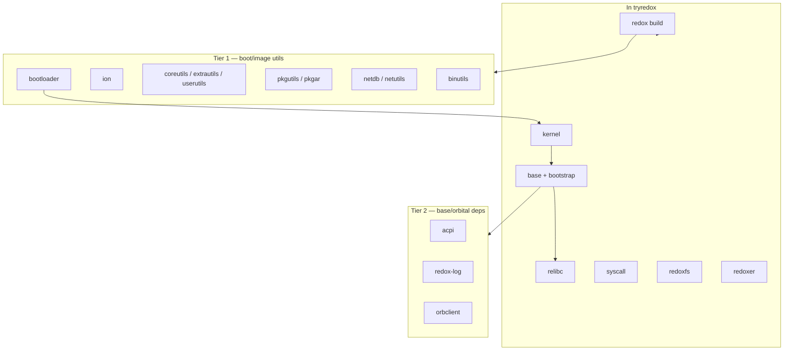

# VENDORED.md — Third-party and upstream code in lerux

This file tracks code copied into lerux from upstream projects (especially Redox), how it differs from upstream, and what still depends on external registries. See [PLAN.md](PLAN.md) for the **vendor everything** policy: no build-time dependencies on Redox GitLab or other moving upstream trees.

**Convention:** vendored trees live under `kernel/`, `userspace/`, or `vendor/` (pick one layout per import; document each row below). Reference trees such as `../tryredox/base` are **not** part of lerux and are not listed here as vendored—only what is **in this repository**.

---

## How to update this file

When you vendor a new component:

1. Copy sources into lerux (do not add `git = "https://gitlab.redox-os.org/…"` to lerux `Cargo.toml`).
2. Add a row to the table below with upstream URL, version or commit, license, and lerux path.
3. List **lerux-specific changes** (patches, features, deleted files).
4. If the import came from a reference checkout, record that commit in **Upstream revision** (or `TBD` until someone pins it).
5. For crates.io dependencies you intend to vendor later, note them under [External dependencies (not yet vendored)](#external-dependencies-not-yet-vendored).

When syncing from upstream Redox, bump **Upstream revision**, re-apply lerux patches, and note the date in **Last synced**.

---

## Kernel divergence from upstream (lerux patches)

Most of `kernel/` is unmodified Redox code (~2026-05 import). The items below are **intentional lerux changes** on top of upstream; re-check them on every kernel sync. Terminology: [docs/GLOSSARY.md](docs/GLOSSARY.md). Postmortem on an earlier trampoline mistake: [docs/trampoline-bytes-postmortem.md](docs/trampoline-bytes-postmortem.md).

### What stays the same

| Area | Status |
|------|--------|
| Syscall surface (`redox_syscall`, scheme handlers) | Unchanged |
| Memory manager (`kernel/rmm/`) | Unchanged |
| Boot strings and `sys:uname` | Still report **"Redox"** (not renamed to lerux) |

### Repository layout (lerux-only)

Upstream ships the kernel as the crate root. lerux wraps it: `Cargo.toml` and `build.rs` at the **repo root**, sources under `kernel/`, plus `justfile`, `qemu/`, `linkers/`, `targets/`.

### Code and build changes

| Change | Upstream | lerux |
|--------|----------|-------|
| SMP trampolines | `nasm` in `build.rs` | Golden `.bin` from `kernel/validation/trampolines/asm/` via `include_bytes!`; validated by `just validate-trampolines` |
| PVH boot stub | `pvh_boot.S` + `cc` | `pvh_boot.rs` (`global_asm!`); `direct-boot` feature only |
| Boot args | Redox bootloader supplies `KernelArgs` | `direct-boot` synthesizes args in `direct_boot.rs` for `qemu -kernel` |
| `build.rs` | nasm + cc on x86 | CPU features from `config.toml`; embeds `build/initfs.bin` when `direct-boot` |
| CI | Upstream GitLab | `.github/workflows/rust.yml`: fmt, clippy, check, **trampolines**, **initfs**, smoke |
| Userspace bootstrap | Always spawned from initfs | `direct-boot` skips spawn; `direct-boot-userspace` spawns when bootstrap ELF is in initfs |
| SSE for userspace | Upstream sets CR4 via boot path | `early_init` sets `CR4_ENABLE_SSE` (+ `CR4_ENABLE_OS_XSAVE` when XSAVE present) so bootstrap/init can use SSE |
| Direct-boot memory map | Static minimal map (assumed ~512 MiB) | Enlarged kernel reservation (0x0400_0000) + shifted free base to tolerate larger embedded initfs blob (redoxfs + stub + services for rustc-hosting smoke). See `kernel/src/startup/direct_boot.rs`. |

Building **without** `direct-boot` still targets a normal Redox-style kernel but expects the full Redox build system (see [BUILDING-standalone.md](BUILDING-standalone.md)).

---

## Vendored in-tree (lerux repository)

| Component | In-repo path | Upstream | Upstream revision | License | Last synced | Lerux-specific changes |
|-----------|--------------|----------|-------------------|---------|-------------|-------------------------|
| Redox kernel | `kernel/` | [redox-os/kernel](https://gitlab.redox-os.org/redox-os/kernel) | `TBD` (initial import ~2026-05; pin commit on next sync) | MIT (`kernel/LICENSE`) | 2026-05 | Direct-boot PVH stub in Rust; SMP trampolines from NASM golden files (`include_bytes!`); `just validate-trampolines` + CI; `direct-boot` embeds initfs; `direct-boot-userspace` spawns bootstrap; no nasm/cc in kernel build |
| RMM (memory manager) | `kernel/rmm/` | Same kernel tree / [redox-os/rmm](https://gitlab.redox-os.org/redox-os/rmm) | `TBD` (bundled with kernel import) | MIT | 2026-05 | Path dependency from root `Cargo.toml`; no separate remote |
| initfs (reader) | `userspace/initfs/` | [base/initfs](https://gitlab.redox-os.org/redox-os/base) | `TBD` (copied from `tryredox/base/initfs` 2026-05-30) | MIT | 2026-05-30 | Standalone crate in root workspace; `plain` from crates.io |
| initfs archiver (host) | `userspace/initfs-tools/` | [base/initfs/tools](https://gitlab.redox-os.org/redox-os/base) | `TBD` (copied from `tryredox/base/initfs/tools` 2026-05-30) | MIT | 2026-05-30 | `redox-initfs-ar` / `redox-initfs-dump`; path dep to `userspace/initfs` |
| bootstrap | `userspace/bootstrap/` | [base/bootstrap](https://gitlab.redox-os.org/redox-os/base) | `TBD` (copied from `tryredox/base/bootstrap` 2026-05-30) | MIT | 2026-05-30 | Own `[workspace]`; `redox-rt` path to `userspace/runtime/redox-rt`; git dep removed |
| userspace runtime | `userspace/runtime/` | [relibc/redox-rt + generic-rt](https://gitlab.redox-os.org/redox-os/relibc) | `TBD` (forked from `tryredox/relibc` 2026-05-30) | MIT | 2026-05-30 | Lerux-owned `no_std` runtime; bootstrap links here; init/daemons still on `.toolchain` relibc until step 2 |
| relibc (partial) | `vendor/relibc/` | [redox-os/relibc](https://gitlab.redox-os.org/redox-os/relibc) | `TBD` (copied from `tryredox/relibc` 2026-05-30) | MIT / BSD | 2026-05-31 | Snapshot for init/daemon link; **`redox-rt` / `generic-rt`** bundled under `vendor/relibc/` for relibc build; **`userspace/runtime/`** used by bootstrap only; sysroot via **`scripts/build-sysroot.sh`** |
| init | `userspace/init/` | [base/init](https://gitlab.redox-os.org/redox-os/base) | `TBD` (copied from `tryredox/base/init` 2026-05-30) | MIT | 2026-05-31 | Static link via in-tree sysroot + `targets/x86_64-unknown-redox.json`; no workspace `libc` crate |
| logd, zerod, randd, ramfs | `userspace/{logd,zerod,randd,ramfs}/` | [base/*](https://gitlab.redox-os.org/redox-os/base) | `TBD` (copied from `tryredox/base` 2026-05-30) | MIT | 2026-05-30 | Minimal early daemons; staged into `initfs-staging/bin/` |
| rtcd | `userspace/drivers/rtcd/` | [base/drivers/rtcd](https://gitlab.redox-os.org/redox-os/base) | `TBD` (copied from `tryredox/base/drivers/rtcd` 2026-05-30) | MIT | 2026-05-30 | Required by trimmed `00_runtime.target` |
| daemon, scheme-utils | `userspace/daemon/`, `userspace/scheme-utils/` | [base/*](https://gitlab.redox-os.org/redox-os/base) | `TBD` (copied from `tryredox/base` 2026-05-30) | MIT | 2026-05-30 | Shared daemon plumbing for logd/zerod/randd/ramfs/rtcd |
| config (userspace) | `userspace/config/` | [base/config](https://gitlab.redox-os.org/redox-os/base) | `TBD` (copied from `tryredox/base/config` 2026-05-30) | MIT | 2026-05-30 | Build-time config for daemons |
| redox-log | `vendor/redox-log/` | [redox-os/redox-log](https://gitlab.redox-os.org/redox-os/redox-log) | `TBD` (copied from `tryredox/redox-log` 2026-05-30) | MIT | 2026-05-30 | Logging crate for daemons |
| redoxfs | `userspace/redoxfs/` | [redox-os/redoxfs](https://gitlab.redox-os.org/redox-os/redoxfs) | TBD (copied from ../tryredox/redoxfs 2026-06) | MIT | 2026-06 | Base-first import to support rustc-hosting goal (real FS for source trees/artifacts); minimal mechanical integration only (DiskMemory/DiskFile backends, scheme provider); no FUSE; preserves Redox scheme interface for compatibility with "rustc built for redox"; AI-driven unsafe/idiom cleanup and own-path changes (started post-green: runtime port for no_std daemon under RUNTIME_REDOXFS flag, SAFETY docs, partial bin/mount.rs port to redox-rt/syscall; wired into build/smoke path behind flag). |
| initfs staging | `userspace/initfs-staging/` | lerux + upstream units | — | MIT | 2026-05-31 | `bin/` + trimmed `lib/init.d/`; **no** dynamic `libc.so` / `ld64` (static ELFs) |
| QEMU bring-up (loader scripts, docs) | `qemu/` | lerux-original + Redox boot concepts | — | MIT (lerux) | — | Custom loader / `KernelArgs` handoff; `smoke-test.sh` supports `USERSPACE_SMOKE=1` |

---

## Planned vendoring (from Redox base / userspace roadmap)

Source reference: `tryredox/base` (or upstream [redox-os/base](https://gitlab.redox-os.org/redox-os/base)). Phase B minimal daemons are vendored; remaining rows are Phase C+.

| Planned component | Suggested path | Upstream (reference) | Notes |
|-------------------|----------------|----------------------|--------|
| libredox (full in-tree) | `vendor/libredox/` | relibc / crates.io | bootstrap still uses crates.io `libredox` 0.1.17 |
| Drivers (pcid, virtio, …) | `userspace/drivers/` or `vendor/drivers/` | `base/drivers` | Phase C in [PLAN.md](PLAN.md) |

---

## Reference tree: `tryredox` vs [gitlab.redox-os.org/redox-os](https://gitlab.redox-os.org/redox-os)

The sibling directory `../tryredox/` (or your local clone of the same layout) holds **reference checkouts** for studying and copying into lerux. It is **not** vendored into lerux and is **not** required to build lerux.

This section records what is present under `tryredox/` versus what the upstream Redox project treats as fundamental. Sources: official [redox](https://gitlab.redox-os.org/redox-os/redox/-/blob/master/README.md) README, `tryredox/redox/config/base.toml`, `config/minimal.toml`, `config/desktop-minimal.toml`, and `tryredox/redox/recipes/core/*/recipe.toml`. (GitLab’s group browser may require login; repo lists are also defined by the build system recipes.)

**Population (2026-05-30):** Tier 1–3 repos and Tier 5 core recipe repos were added via `git clone --depth 1` into `../tryredox/`. **`acpi`** was cloned with `-b redox-6.x`. Tier 4 **toolchain** forks (`gcc`, `llvm-project`, `rust`, `binutils-gdb`) were **not** cloned (multi‑GB; only needed for full upstream image cooks).

### What `tryredox` already has (top-level git clones)

| Directory | GitLab repo | Role |
|-----------|-------------|------|
| `kernel/` | [kernel](https://gitlab.redox-os.org/redox-os/kernel) | Microkernel |
| `base/` | [base](https://gitlab.redox-os.org/redox-os/base) | Daemons, drivers, **bootstrap** (inside this repo, not a sibling), initfs, init, … |
| `relibc/` | [relibc](https://gitlab.redox-os.org/redox-os/relibc) | C/POSIX runtime, `redox-rt`, `libredox` |
| `syscall/` | [syscall](https://gitlab.redox-os.org/redox-os/syscall) | `redox_syscall` ABI crate |
| `redoxfs/` | [redoxfs](https://gitlab.redox-os.org/redox-os/redoxfs) | Default filesystem |
| `redox/` | [redox](https://gitlab.redox-os.org/redox-os/redox) | Build system + `recipes/` |
| `redoxer/` | [redoxer](https://gitlab.redox-os.org/redox-os/redoxer) | Cross-build / VM helper |
| `orbital/` | [orbital](https://gitlab.redox-os.org/redox-os/orbital) | Display server / window manager |
| `acid/` | [acid](https://gitlab.redox-os.org/redox-os/acid) | Small test suite |
| `book/` | [book](https://gitlab.redox-os.org/redox-os/book) | Documentation (not runtime) |
| `uefi/` | [uefi](https://gitlab.redox-os.org/redox-os/uefi) | UEFI-related boot support |

Also present: `redox-master/` (typically **no** `.git`) — looks like another snapshot/copy of the build tree, not a separate upstream project.

**Coverage:** roughly **11 git checkouts** — strong on kernel, runtime, syscall ABI, `base`, filesystem, and build orchestration — but **not** enough to produce a standard bootable image from `config/base.toml` without cloning more repos at cook time.

**Not missing:** `bootstrap` — it lives under `base/bootstrap/`, not as a top-level sibling.

### Tier 1 — Minimal **bootable** Redox image

Required by `tryredox/redox/config/base.toml` (`[packages]`) and/or `config/minimal.toml`. Each has a `recipes/core/*/recipe.toml` on GitLab; **now cloned** under `tryredox/` (unless noted):

| Repo (`tryredox/`) | Why it matters |
|--------------|----------------|
| [bootloader](https://gitlab.redox-os.org/redox-os/bootloader) | Loads kernel + initfs; `bootloader = {}` in `base.toml` |
| [ion](https://gitlab.redox-os.org/redox-os/ion) | Default shell (`minimal.toml`, users in `base.toml`) |
| [coreutils](https://gitlab.redox-os.org/redox-os/coreutils) | Basic Unix utilities |
| [extrautils](https://gitlab.redox-os.org/redox-os/extrautils) | `dmesg`, `less`, etc. (`minimal.toml`) |
| [pkgutils](https://gitlab.redox-os.org/redox-os/pkgutils) | Package manager (README “essential”) |
| [pkgar](https://gitlab.redox-os.org/redox-os/pkgar) | Package archive format (core recipe) |
| [userutils](https://gitlab.redox-os.org/redox-os/userutils) | User management (`base.toml`) |
| [netdb](https://gitlab.redox-os.org/redox-os/netdb) | Network DB (`base.toml`) |
| [netutils](https://gitlab.redox-os.org/redox-os/netutils) | `ping`, DHCP-related tools, etc. (`base.toml`) |
| [binutils](https://gitlab.redox-os.org/redox-os/binutils) | Redox toolchain / linking (core recipe) |

**Also cloned:** [installer](https://gitlab.redox-os.org/redox-os/installer) — image build (`server.toml`, book).

With Tier 1–3 present locally, `tryredox/redox/` cooks can use local source trees if recipes/paths are pointed at siblings (default recipes still use Git URLs unless patched).

### Tier 2 — **Fundamental GitLab dependencies** of `base` / `orbital`

Referenced from `tryredox/base/Cargo.toml`, `orbital`, or drivers. **Now cloned** under `tryredox/` (lerux vendoring should still copy in-tree, not use these remotes):

| Repo | Pulled by |
|------|-----------|
| [acpi](https://gitlab.redox-os.org/redox-os/acpi) | `base` (`acpid`, AML), kernel ACPI paths |
| [redox-log](https://gitlab.redox-os.org/redox-os/redox-log) | `base`, `orbital`, many drivers |
| [rehid](https://gitlab.redox-os.org/redox-os/rehid) | `base/drivers/input/usbhidd` |
| [orbclient](https://gitlab.redox-os.org/redox-os/orbclient) | Orbital, graphics/input drivers (workspace may use crates.io version; recipes still track GitLab) |
| [liborbital](https://gitlab.redox-os.org/redox-os/liborbital) | C/C++ Orbital clients (graphics / portability path) |

For lerux’s **vendor everything** policy, Tier 2 matters as much as Tier 1 when copying from `tryredox/base` or `orbital`.

### Tier 3 — README “essential” / minimal **desktop**

From the Redox README and `config/desktop-minimal.toml` — **now cloned** (with `orbital/`):

| Repo (`tryredox/`) | Role |
|--------------|------|
| [termion](https://gitlab.redox-os.org/redox-os/termion) | Terminal library (README essential list) |
| **orbclient** | See Tier 2 |
| [orbterm](https://gitlab.redox-os.org/redox-os/orbterm) | Terminal emulator |
| [orbutils](https://gitlab.redox-os.org/redox-os/orbutils) | Orbital utilities |
| [orbdata](https://gitlab.redox-os.org/redox-os/orbdata) | Orbital data / assets |

With Tier 3 siblings present, `desktop-minimal.toml` package sources are available locally for study and vendoring.

### Tier 4 — Build infrastructure (not OS runtime)

| Repo | In `tryredox/`? | Role |
|------|-----------------|------|
| Toolchain forks under `redox/recipes/dev/` | **No** (size) | [gcc](https://gitlab.redox-os.org/redox-os/gcc), [llvm-project](https://gitlab.redox-os.org/redox-os/llvm-project), [rust](https://gitlab.redox-os.org/redox-os/rust), [binutils-gdb](https://gitlab.redox-os.org/redox-os/binutils-gdb) — clone separately if doing full upstream image builds |

### Tier 5 — Other `recipes/core/` repos (useful, not always “minimal”)

**Cloned 2026-05-30:** [findutils](https://gitlab.redox-os.org/redox-os/findutils), [dash](https://gitlab.redox-os.org/redox-os/dash), [contain](https://gitlab.redox-os.org/redox-os/contain), [profiled](https://gitlab.redox-os.org/redox-os/profiled), [strace-redox](https://gitlab.redox-os.org/redox-os/strace-redox), [openlibm](https://gitlab.redox-os.org/redox-os/openlibm), [dlmalloc-rs](https://gitlab.redox-os.org/redox-os/dlmalloc-rs).

Defer for lerux until after Phases A–B in [PLAN.md](PLAN.md): full desktop extras, games, WIP recipes, COSMIC, etc.

### Boot-path diagram (`tryredox` vs gaps)

### Summary for lerux vendoring

| Area | `tryredox` status | Lerux implication |
|------|-------------------|-------------------|
| Kernel / syscall / relibc | Present | Kernel already in lerux; vendor relibc + syscall in-tree when enabling userspace |
| `base` (initfs, bootstrap, daemons, drivers) | Present | Primary source for Phase A–B vendoring |
| Bootloader | In `tryredox/` | Keep lerux `qemu/` path or vendor `bootloader` / UEFI tree |
| Utils / packaging / shell | In `tryredox/` | Not needed for first bootstrap milestone; needed for “real” Redox image parity |
| `acpi`, `redox-log`, `orbclient` | In `tryredox/` | Vendor in-tree when building `base` or `orbital` inside lerux |
| Desktop | In `tryredox/` (Tier 3) | Defer for lerux until after minimal userspace |

When cloning new reference repos into `tryredox/`, update the tables above and note the date.

---

## External dependencies (not yet vendored)

These are pulled at build time from **crates.io** or **git** today. Per project policy, git remotes (especially Redox) should be eliminated by vendoring; crates.io crates may stay until explicitly copied in-tree.

| Crate / dependency | Source | Version / revision | Used by | Vendoring status |
|--------------------|--------|--------------------|---------|------------------|
| `redox_syscall` | crates.io | 0.8.0 | Root kernel | OK for now; pin in `Cargo.lock`; consider in-tree if API fork needed |
| `redox-path` | crates.io | 0.2.0 | Root kernel | OK for now |
| `fdt` | git `github.com/repnop/fdt` | `2fb1409e…` | Root kernel (`Cargo.toml`) | **Should vendor** into `vendor/fdt/` (non-Redox but still git dep) |
| Other kernel deps | crates.io | see `Cargo.lock` | Root kernel | Audit periodically; vendor if supply-chain or offline build matters |

**Not allowed long-term:** `git = "https://gitlab.redox-os.org/redox-os/…"` (or equivalent) in lerux manifests.

---

## Attribution

- Root [LICENSE](LICENSE) — Copyright (c) 2026 Julian le Roux (MIT).
- Vendored Redox kernel — Copyright (c) 2017 Jeremy Soller and contributors; see [kernel/LICENSE](kernel/LICENSE).
- Preserve upstream copyright notices in vendored subtrees when copying new components.
- Do not remove `kernel/LICENSE` or per-crate license files when adding `userspace/` trees.

---

## Sync procedure (kernel / large imports)

1. Identify upstream commit on [redox-os/kernel](https://gitlab.redox-os.org/redox-os/kernel) (or relevant repo).
2. Diff against current `kernel/`; apply lerux-only commits on top (direct-boot, trampolines, etc.).
3. Update **Upstream revision** and **Last synced** in this file.
4. Run `just build-direct`, `just smoke`, `just validate-trampolines`, and `cargo test --bin kernel trampoline`.
5. Note breaking syscall or ABI changes against planned userspace vendoring.

---

## Related documents

- [PLAN.md](PLAN.md) — roadmap, phases, and vendoring policy
- [NOTES.md](NOTES.md) — verified direct-boot behavior and debug notes
- [README.md](README.md) — project overview
- [docs/GLOSSARY.md](docs/GLOSSARY.md) — terminology
- [docs/trampoline-bytes-postmortem.md](docs/trampoline-bytes-postmortem.md) — trampoline byte-array incident
