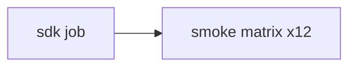

# CI and local smoke tests

GitHub Actions workflow: [`.github/workflows/rust.yml`](../.github/workflows/rust.yml).

## Pipeline

1. **sdk** — Docker image, fetch sources, build Microkit SDK (cached), **prebuild patched SP804 QEMU** (cached), upload SDK artifact.
2. **smoke** — 12 parallel matrix jobs; each restores SDK artifact, per-job `build/` cache, and SP804 QEMU (init/composed/http-composed only).

## Smoke matrix

| Job ID | Command | Notes |
|--------|---------|-------|
| `aarch64` | `just test` | Serial hello on virt |
| `x86_64` | `BOARD=x86_64_generic just test` | COM1 serial |
| `riscv64` | `just test-riscv` | NS16550 MMIO |
| `virtio` | `just disk-img && just test-virtio` | aarch64 virtio blk/net + TCP RX |
| `echo` | `just test-echo` | aarch64 echo IPC |
| `x86-echo` | `just test-x86-echo` | x86 echo IPC |
| `riscv-echo` | `just test-riscv-echo` | RISC-V echo IPC |
| `riscv-virtio` | `just disk-img && just test-riscv-virtio` | RISC-V virtio |
| `init` | `just test-init` | PL031 + SP804; patched QEMU |
| `composed` | `just disk-img && just test-composed` | init + virtio in one system |
| `http` | `just test-http` | virtio-net HTTP `GET /` via hostfwd |
| `http-composed` | `just test-http-composed` | init + HTTP; patched QEMU |

Local mirror: `just test-all` (requires full SDK; creates `support/disk.img` once).

## Caches

| Cache | Key inputs | Restored in |
|-------|------------|-------------|
| Workspace | `deps/versions.toml`, `scripts/fetch.sh` | sdk |
| SDK | versions + `SDK_CACHE_SUFFIX` | sdk |
| SP804 QEMU | patch + `install-qemu-sp804.sh` | sdk (build), smoke init/composed/http-composed (restore) |
| Per-smoke `build/` | `Cargo.lock` + matrix job id | smoke |

SP804 QEMU is built once in the **sdk** job so `init`, `composed`, and `http-composed` do not each cold-build QEMU (~4 min). Cache paths include install prefix, source tree, and tarball.

Caches are saved with `if: always()` when the artifact exists, so a failing smoke job still retains partial `build/` and a completed QEMU install.

## Patched QEMU

Stock QEMU `virt` lacks SP804 at `0x90d0000`. Init, composed, and http-composed smokes use [`scripts/install-qemu-sp804.sh`](../scripts/install-qemu-sp804.sh). The script prints **only** the install `bin` directory on stdout (build logs go to stderr) so `justfile` can prepend it to `PATH` safely.

## Troubleshooting

| Symptom | Likely cause |
|---------|----------------|
| `Argument list too long` on `python3` | Corrupted `PATH` from capturing QEMU build stdout — fixed in `install-qemu-sp804.sh` |
| Init passes, timer times out | Stock QEMU used instead of patched build — check `which qemu-system-aarch64` |
| Composed flaky on `init ok` | Serial/debug interleaving — `boot-init` notifies `hello` before virtio (composed-sync) |
| `libglib2.0-dev` missing locally | Install build deps or use Docker (`lerux-dev` image) |