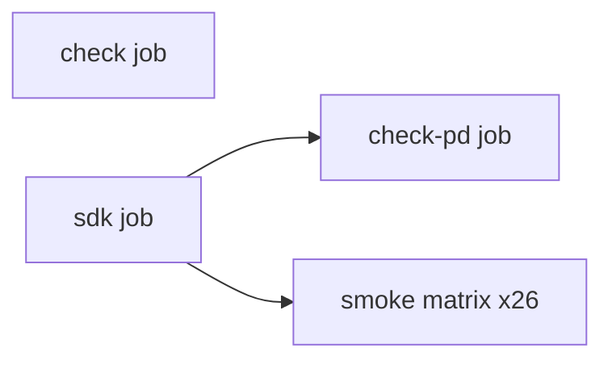

# CI and local smoke tests

GitHub Actions workflow: [`.github/workflows/rust.yml`](../.github/workflows/rust.yml).

## Pipeline

1. **check** — `just check` (`cargo fmt --all --check` + clippy on host crates; no SDK).
2. **sdk** — Docker image, fetch sources, build Microkit SDK (cached), **prebuild patched SP804 QEMU** (cached), upload SDK artifact.
3. **check-pd** — `just check-pd` (cross-target clippy on PD + shared userspace crates; needs SDK artifact).
4. **smoke** — 26 parallel matrix jobs; each restores SDK artifact, per-job `build/` cache, and SP804 QEMU (init/composed/blk-composed/http-composed/net-composed/ipc-composed only).

Local mirror: `just check` (format + clippy for `lerux-cli` and `lerux-interface-types`); `just check-pd` after `just build-sdk` (or `just check-all` for both).

## Smoke matrix

| Job ID | Command | Notes |
|--------|---------|-------|
| `aarch64` | `just test` | Serial hello on virt |
| `x86_64` | `BOARD=x86_64_generic just test` | COM1 serial |
| `riscv64` | `just test-riscv` | NS16550 MMIO |
| `virtio` | `just disk-img && just test-virtio` | aarch64 virtio blk/net + TCP RX |
| `echo` | `just test-echo` | aarch64 echo IPC |
| `x86-echo` | `just test-x86-echo` | x86 echo IPC |
| `riscv-echo` | `just test-riscv-echo` | RISC-V echo IPC |
| `riscv-virtio` | `just disk-img && just test-riscv-virtio` | RISC-V virtio |
| `init` | `just test-init` | PL031 + SP804; patched QEMU |
| `composed` | `just disk-img && just test-composed` | init + virtio in one system |
| `blk-composed` | `just disk-img && just test-blk-composed` | init + block IPC; patched QEMU |
| `http` | `just test-http` | virtio-net HTTP `GET /` via hostfwd |
| `http-composed` | `just test-http-composed` | init + HTTP; patched QEMU |
| `x86-http` | `just test-x86-http` | x86 q35 PCI virtio-net HTTP via hostfwd |
| `riscv-http` | `just test-riscv-http` | RISC-V MMIO virtio-net HTTP via hostfwd |
| `x86-virtio` | `just disk-img && just test-x86-virtio` | x86 q35 PCI virtio-blk/net + TCP RX |
| `blk` | `just test-blk` | aarch64 block IPC over virtio-blk |
| `riscv-blk` | `just test-riscv-blk` | RISC-V block IPC |
| `x86-blk` | `just test-x86-blk` | x86 PCI virtio-blk block IPC |
| `net` | `just test-net` | aarch64 net IPC over virtio-net (UDP TX) |
| `fetch` | `just test-fetch` | aarch64 HTTP fetch over net IPC (TCP + DNS) |
| `riscv-net` | `just test-riscv-net` | RISC-V net IPC |
| `x86-net` | `just test-x86-net` | x86 PCI virtio-net net IPC |
| `net-composed` | `just test-net-composed` | init + net IPC; patched QEMU |
| `ipc-composed` | `just disk-img && just test-ipc-composed` | init + blk/net IPC; patched QEMU |

Local mirror: `just test-all` (requires full SDK; creates `support/disk.img` once).

## Caches

| Cache | Key inputs | Restored in |
|-------|------------|-------------|
| Workspace | `deps/versions.toml`, `tools/lerux-cli` | sdk |
| SDK | versions + `SDK_CACHE_SUFFIX` | sdk |
| SP804 QEMU | patch + `install-qemu-sp804.sh` | sdk (build), smoke init/composed/blk-composed/http-composed/net-composed/ipc-composed (restore) |
| Shared `build/target/` | `Cargo.lock` | check-pd, smoke (all jobs) |
| Per-smoke `build/<board>/` | `Cargo.lock` + matrix job id | smoke |

SP804 QEMU is built once in the **sdk** job so `init`, `composed`, `blk-composed`, `http-composed`, and `net-composed` do not each cold-build QEMU (~4 min). Cache paths include install prefix, source tree, and tarball.

Caches are saved with `if: always()` when the artifact exists, so a failing smoke job still retains partial `build/` and a completed QEMU install.

## Patched QEMU

Stock QEMU `virt` lacks SP804 at `0x90d0000`. Init, composed, blk-composed, http-composed, and net-composed smokes use `cargo run -p lerux-cli -- install sp804-qemu`. The installer prints **only** the install `bin` directory on stdout (build logs go to stderr).

## Troubleshooting

| Symptom | Likely cause |
|---------|----------------|
| `Argument list too long` on `python3` | Corrupted `PATH` from capturing QEMU build stdout — fixed in SP804 installer stderr/stdout split |
| Init passes, timer times out | Stock QEMU used instead of patched build — check `which qemu-system-aarch64` |
| Composed flaky on `init ok` | Serial/debug interleaving — `boot-init` notifies `hello` before virtio (composed-sync) |
| `x86-http`: serial shows `listening`, `curl` times out | Stale QEMU or `tcp-echo-server` on host **18080** — see [boards.md — x86 HTTP inbound](boards.md#x86-http-inbound-operational-notes); smoke recipe kills both before start |
| `x86-http`: QEMU idle at `listening` | Expected until host `curl` — guest waits on driver notifications; use `just test-x86-http` or curl from another terminal |
| `x86-virtio` fails `TCP RX ok` after `x86-http` | Usually port **18080** still in use; kill stale QEMU/echo server, rerun virtio test |
| Piping `just test … \| tail` shows no output then SIGTERM | `tail` buffers until the command exits; run smoke tests without `tail` when debugging |
| `libglib2.0-dev` missing locally | Install build deps or use Docker (`lerux-dev` image) |