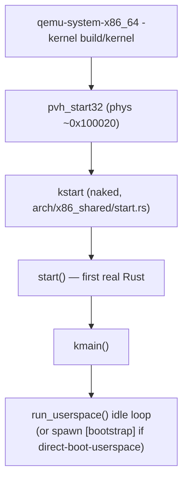

# QEMU x86 Boot Sequence (lerux direct-boot image)

This document gives a precise, step-by-step account of what happens from the moment you run

```sh
just qemu-direct
# or
qemu-system-x86_64 -kernel build/kernel ...
```

until the kernel reaches its idle loop (or, with the `direct-boot-userspace` feature, until early userspace runs).

It is the companion to:
- [kernel/architecture.md](../kernel/architecture.md) (high-level tour)
- [development/qemu.md](qemu.md) (harness and handoff contract)
- [notes.md](../notes.md) (verified bring-up facts and troubleshooting table)
- [building/standalone.md](../building/standalone.md) (how to build)

All file paths below are relative to the repository root unless otherwise noted.

## 1. What "the lerux image" means on QEMU x86

The **current primary development image** is the kernel ELF produced by:

```sh
just build-direct          # KERNEL_CARGO_FEATURES=direct-boot
# produces build/kernel
```

Key characteristics of this path (lerux-only):

- Uses QEMU's `-kernel` loading (no separate Redox bootloader).
- The `direct-boot` Cargo feature is enabled.
- Linker script: [`linkers/x86_64-direct.ld`](linkers/x86_64-direct.ld) (places a Xen PVH ELF note + 32-bit stub + loads the higher-half kernel at physical 2 MiB).
- `build.rs` embeds `build/initfs.bin` (produced by `just build-initfs`) into the kernel image via `include_bytes!`.
- `startup::direct_boot` synthesizes a `KernelArgs` struct at runtime.
- By default userspace bootstrap is skipped (fast kernel-only smoke). Use `direct-boot-userspace` + `just build-direct-userspace` / `just qemu-direct-userspace` for the full path through `bootstrap` → `init`.

The older `qemu/run.sh` + `loader.bin` path (with its own 32→64 transition and ELF loader written in assembly) still exists but is considered legacy/quarantined for bring-up experiments.

## 2. High-level control flow



## 3. Detailed step-by-step

### 3.1 QEMU loads the ELF and follows the Xen PVH note

- QEMU sees the ELF64 header and the special note section placed by the linker at physical address `0x100000`:
  ```ld
  .note.Xen 0x100000 : AT(0x100000) { KEEP(*(.note.Xen)) }
  .pvh.boot 0x100020 : AT(0x100020) { KEEP(*(.pvh.text)) }
  ```
- The note identifies `PVH_ENTRY = 0x00100020` (see `pvh_boot.rs`).
- QEMU loads the kernel's program headers (higher-half virtual addresses mapped so that `0xFFFFFFFF80000000` corresponds to physical `0x200000`).
- QEMU jumps to the 32-bit entry point in the stub (`pvh_start32`).

**lerux note**: The pure-Rust `core::arch::global_asm!` stub replaces the upstream `pvh_boot.S` + `cc` invocation.

### 3.2 pvh_start32 — 32-bit → long mode (pure Rust)

**File**: [`lerux-kernel/src/arch/x86_shared/pvh_boot.rs`](lerux-kernel/src/arch/x86_shared/pvh_boot.rs) (the `global_asm!` block).

Executed with:
- 32-bit protected mode
- Interrupts off (`cli`)
- A minimal identity + high-half page table structure pre-placed at fixed physical addresses (`PVH_PML4` etc.)

Key actions (in order):

1. Set up 32-bit page tables (PML4 + PDPT + PD) using 2 MiB huge pages (`0x183` = present + writable + PS).
2. Identity-map low 1 GiB at `0x00000000`.
3. Map kernel physical base (`KERNEL_PHYS_BASE = 0x200000`) into the higher half via `PD_HIGH`.
4. Mirror low PDPT at PML4[256] for the early `PHYS_OFFSET` linear map.
5. Load CR3 with PML4.
6. Enable PAE + PSE (`CR4`).
7. Enable long mode + NXE in EFER (`0xC0000080` MSR). **NXE is required** because the kernel page tables set the NX bit.
8. Load a minimal GDT (code 0x08, data 0x10).
9. Enable paging + protection (`CR0`).
10. Far jump to 64-bit `long_mode_entry`.
11. In 64-bit: reload segments, set `RSP` to `PVH_STACK64`, jump to `kstart`.

Typical log: none yet (serial not initialized).

If anything is wrong here you usually see a triple fault / QEMU reset with no serial output.

### 3.3 kstart — the naked entry (BSP)

**File**: [`lerux-kernel/src/arch/x86_shared/start.rs:63`](lerux-kernel/src/arch/x86_shared/start.rs) (`#[unsafe(naked)] extern "C" fn kstart`).

Responsibilities:
- Verify that the linker + loader zeroed BSS and preserved `.data` (cheap guard using two statics `BSS_TEST_ZERO` / `DATA_TEST_NONZERO`).
- Set up the static boot stack (`STACK`, 128 KiB).
- For x86_64: `lea rsp, [rip + {stack}+{stack_size}-24]; mov rsi, rsp; jmp {start}`.
- `RDI` still contains whatever QEMU/PVH left (ignored in direct-boot); `RSI` will be passed as `stack_end`.

Crashes here (`xor rax,rax; jmp rax`) produce no useful output.

### 3.4 start() — first real Rust function on the BSP

**File**: [`lerux-kernel/src/arch/x86_shared/start.rs:129`](lerux-kernel/src/arch/x86_shared/start.rs) (`unsafe extern "C" fn start`).

This is the big ordered initialization. Each step is a prerequisite for the next.

```rust
// direct-boot path
let args = crate::startup::direct_boot::get_direct_boot_args();

// 1. Earliest possible output
device::serial::init();                 // 16550 at 0x3f8 (PIO)
#[cfg(not(feature="direct-boot"))] graphical_debug::init(...);

info!("Redox OS starting...");
args.print();
```

**Serial output at this point** (from a real run):
```
kernel::arch::x86_shared::start:INFO -- Redox OS starting...
kernel::startup:INFO -- Kernel: 0:0
...
kernel::startup:INFO -- Bootstrap: 2ADDE0:1353F48
```

Then:

```rust
gdt::init_bsp(stack_end);
idt::init_bsp();
```

- GDT: kernel code/data segments + TSS for the current CPU.
- IDT: exception + IRQ handlers (still no interrupts enabled).

```rust
// x86_64 direct-boot
crate::startup::memory::init(&args, Some(0x100000), None);
paging::init();                         // PAT only
...
interrupt::syscall::init();             // MSR_STAR / LSTAR / SFMASK etc.
allocator::init();                      // maps kernel heap, installs global allocator
crate::log::init();                     // now uses the real logger
...
device::init();
...
device::init_noncore();
```

The call to `args.bootstrap()` builds the `Bootstrap` descriptor (physical frame + page count of the embedded initfs + env).

Finally:

```rust
crate::startup::kmain(bootstrap);
```

### 3.5 Physical memory map + page table construction (startup::memory)

**Core files**:
- [`lerux-kernel/src/startup/memory.rs`](lerux-kernel/src/startup/memory.rs)
- [`lerux-kernel/src/startup/direct_boot.rs:48`](lerux-kernel/src/startup/direct_boot.rs) (the `DIRECT_MEMORY_MAP`)
- [`lerux-kernel/src/memory/mod.rs`](lerux-kernel/src/memory/mod.rs) (`init_mm`)

What happens in `memory::init`:

1. `register_memory_from_kernel_args` walks the synthetic map and marks:
   - Low 1 MiB → Reserved
   - 1 MiB–2 MiB region → Reserved (stub + tables)
   - 2 MiB → 64 MiB-ish → Kernel (contains the loaded image + embedded initfs)
   - Rest of RAM → Free (plus high hole + device regions)
   - Env + bootstrap regions are also registered as `IdentityMap` (so they remain reachable via `phys_to_virt` after CR3 switch).

2. Free areas are turned into the kernel's `AREAS` list (used by the bump allocator and later the real frame allocator).

3. `map_memory`:
   - Creates a brand new kernel page table via `PageMapper::create`.
   - Maps every physical area at `PHYS_OFFSET` (linear map).
   - Remaps the kernel text/rodata/data at `KERNEL_OFFSET` with appropriate flags (RO+execute for text, RO for rodata, RW for data).
   - Re-maps IdentityMap regions and device regions.
   - `mapper.make_current()` → loads CR3.
   - Logs:
     ```
     kernel::startup::memory:INFO -- Paging: building new kernel page tables
     kernel::startup::memory:INFO -- Paging: switching to new kernel page tables
     kernel::startup::memory:INFO -- Paging: new kernel page tables active
     ```

4. A small BumpAllocator hands out the very first frames used by the tables themselves; the used size is printed:
   ```
   kernel::startup::memory:INFO -- Permanently used: 1580 KB
   ```

5. `crate::memory::init_mm(bump_allocator)` hands the remaining free memory to the real frame allocator (`FREELIST` etc.).

After this point the kernel can allocate frames and the higher-half mappings are live.

### 3.6 kmain — last common BSP initialization

**File**: [`lerux-kernel/src/startup/mod.rs:270`](lerux-kernel/src/startup/mod.rs)

```rust
pub(crate) fn kmain(bootstrap: Bootstrap) -> ! {
    ...
    context::init(&mut token);           // creates the [kmain] context
    scheme::init_globals();              // registers built-in schemes (proc, pipe, debug, ...)
    ...
    BOOTSTRAP.call_once(|| bootstrap);

    if cfg!(feature="direct-boot") && !cfg!(feature="direct-boot-userspace") {
        info!("direct-boot mode: skipping userspace bootstrap for kernel-only testing");
    } else {
        // spawn userspace_init as a runnable context named "[bootstrap]"
        context::spawn(..., userspace_init, ...);
    }

    run_userspace(&mut token)            // never returns
}
```

`run_userspace` is the scheduler loop:

```rust
loop {
    interrupt::disable();
    match context::switch(token) { ... }
}
```

It will either switch to a runnable context or `enable_and_halt` when idle.

At this point the first INFO line from kmain appears and the system is "up".

### 3.7 (optional) Userspace bootstrap path (`direct-boot-userspace`)

When enabled:

- `context::spawn` creates a context that will run `userspace_init`.
- `userspace_init` calls `syscall::process::usermode_bootstrap`.
- The kernel copies the entire embedded `initfs_blob()` into the new address space (starting at user virtual 0x1000 in the current layout).
- It reads the entry point from the RedoxFtw archive header at offset `0x1a` (little-endian u64):
  ```rust
  let bootstrap_entry = u64::from_le_bytes(bootstrap_slice[0x1a..0x22] ...);
  ...
  regs.set_instr_pointer(bootstrap_entry);
  ```
- The bootstrap binary (built from `userspace/bootstrap`) becomes PID 1. It mounts `/scheme/initfs`, starts `init`, etc.

See also the Phase B smoke output in `notes.md`.

## 4. Synthetic KernelArgs and the embedded initfs

All values come from `startup::direct_boot::get_direct_boot_args()`:

- `areas` = the static `DIRECT_MEMORY_MAP` (6 entries).
- `env` = `"direct-boot=1\0"`.
- `hwdesc` = 0 (no ACPI RSDP supplied → expected ACPI/MADT warnings).
- `bootstrap_base/size` = virtual address of the `INITFS_BLOB` turned into a physical address via a simple `virt_to_phys` that knows the load offset.

The blob itself lives in the kernel's read-only data after linking.

## 5. The legacy loader path (qemu/ tree)

For completeness (not the recommended path):

- `qemu/run.sh` assembles either `loader.asm` (nasm) or `loader.S` (gas).
- Places `loader.bin` at 0x100000 and the kernel at 0x200000 via QEMU device loaders.
- The loader contains its own multiboot header + 32-bit page tables + ELF loader.
- It synthesizes a minimal `KernelArgs` at physical 0x20000 and jumps to `kstart` with RDI pointing at it.
- Many of the early steps are duplicated in assembly.

This path is kept for experiments but is not the "lerux image" story.

## 6. Reproducing the sequence yourself

```sh
# Build
just build-direct

# Live serial (recommended)
just qemu-direct

# Or with more RAM / SMP for userspace experiments
just qemu-direct-userspace -- -m 1G -smp 2

# Headless + capture for diffing
qemu-system-x86_64 -kernel build/kernel -m 512 \
    -serial file:qemu-serial.log -display none -no-reboot
```

**Useful GDB breakpoints** (use full paths):

```
break pvh_start32
break kstart
break kernel::arch::x86_shared::start::start
break kernel::startup::kmain
```

See `just gdb`, `qemu/debug.sh`, and the breakpoint table in `notes.md`.

The smoke test (`just smoke`) asserts a subset of the early messages:

```rust
// from qemu/smoke-test.sh
REQUIRED_MARKERS=(
    "Redox OS starting..."
    "Memory:"
    "Paging: new kernel page tables active"
    "Permanently used:"
)
SUCCESS_MARKER="direct-boot mode: skipping userspace bootstrap"
```

## 7. Common early-boot failure modes (pointers)

See the large troubleshooting table in [`docs/notes.md`](../notes.md). Highlights that affect this exact sequence:

- Missing NXE → reserved-bit page fault immediately after CR3 load.
- Graphical debug enabled in direct-boot → crash (skipped on purpose).
- `bootstrap_base == 0` with non-zero size expectation → "frame 0x0 is reserved".
- initfs too big for the memory map reservation → overlaps or paging failures.

---

This document is intended to be kept in sync with the code. If a boot step changes, update both the source comments and this file, then re-verify with `just smoke`.
