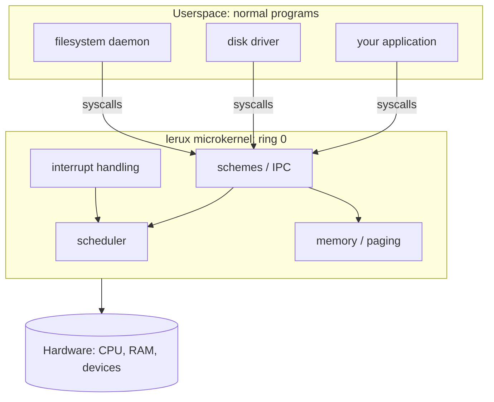
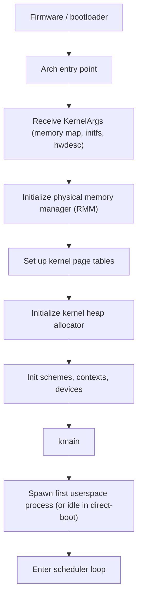
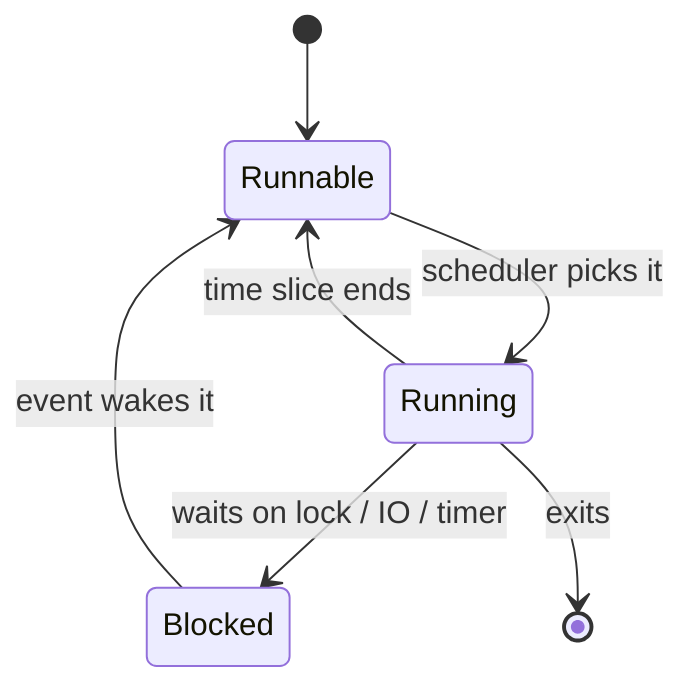
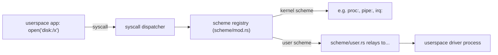

# lerux kernel architecture (a beginner's tour)

This document explains how the lerux kernel works for a software engineer who is
comfortable with Rust but has **never written an operating system**. It assumes
no prior knowledge of paging, interrupts, scheduling, or microkernels — each of
those terms is introduced where it first matters.

If you only read one document about the kernel internals, read this one. It is
the map; the source files are the territory. Throughout, headings link to the
concrete files under [`lerux-kernel/src/`](../../lerux-kernel/src/) that
implement each idea, and those files carry matching module-level docs (`//!`)
that point back here.

> Terminology note: lerux is a fork of the Redox OS microkernel. You will see
> the names "Redox" and "lerux" used together. "Redox" usually refers to the
> upstream design and ABI we inherit; "lerux" refers to our own path (the "Only
> Rust" goal, direct-boot, the inlined zero-dependency crates). See
> [context.md](../context.md) and [GLOSSARY.md](../GLOSSARY.md) for the project
> vocabulary, and [vendored.md](../vendored.md) for the list of intentional
> divergences from upstream.

## Table of contents

1. [What is a kernel, and what kind is this?](#1-what-is-a-kernel-and-what-kind-is-this)
2. [How to read the source](#2-how-to-read-the-source)
3. [Boot: from CPU reset to the scheduler](#3-boot-from-cpu-reset-to-the-scheduler)
4. [Memory model: physical frames, virtual addresses, paging](#4-memory-model-physical-frames-virtual-addresses-paging)
5. [Processes and scheduling](#5-processes-and-scheduling)
6. [System calls: the user/kernel boundary](#6-system-calls-the-userkernel-boundary)
7. [Schemes: the kernel's "everything is a file" layer](#7-schemes-the-kernels-everything-is-a-file-layer)
8. [Interrupts and devices](#8-interrupts-and-devices)
9. [SMP: running on many CPUs](#9-smp-running-on-many-cpus)
10. [The inlined `lerux-*` crates](#10-the-inlined-lerux-crates)
11. [Suggested reading order](#11-suggested-reading-order)

---

## 1. What is a kernel, and what kind is this?

A **kernel** is the first piece of software that runs after the firmware hands
over the machine. It owns the hardware: the CPU(s), physical memory (RAM), and
devices. Everything else — shells, compilers, editors — runs as **userspace**
programs that must ask the kernel for access to those resources. The kernel is
the only code that runs in the CPU's most privileged mode (often called "ring 0"
on x86).

There are two broad designs:

- A **monolithic kernel** (like Linux) puts almost everything — device drivers,
  filesystems, the network stack — inside the kernel itself, running with full
  privileges.
- A **microkernel** (like Redox, and therefore lerux) keeps the kernel tiny. It
  handles only the things that *must* be privileged: memory mapping, scheduling,
  inter-process communication, and the lowest-level CPU/interrupt handling.
  Drivers and filesystems run as ordinary userspace programs.



Why a microkernel matters when reading this code: a lot of functionality you
might expect to find "in the kernel" (like a real filesystem) is *not here*. The
kernel instead provides a way for userspace drivers to register themselves and
receive requests. That mechanism is called a **scheme** (see
[section 7](#7-schemes-the-kernels-everything-is-a-file-layer)).

The lerux-specific twist is the **"Only Rust"** goal: from CPU reset through
userspace, only machine code produced by the Rust toolchain should execute. This
is why the kernel has no C and (almost) no hand-written assembler, and why it
inlines its dependencies as `lerux-*` source trees instead of pulling them from
crates.io. See [plan.md](../plan.md) for the policy and migration sequence.

## 2. How to read the source

The kernel lives in [`lerux-kernel/src/`](../../lerux-kernel/src/). The crate
root is [`main.rs`](../../lerux-kernel/src/main.rs), which wires everything
together. It is built from the **repository root** `Cargo.toml`, not from a
`Cargo.toml` inside `lerux-kernel/`.

Two kinds of code live side by side:

- **Kernel-owned modules** — `arch/`, `context/`, `memory/`, `scheme/`,
  `startup/`, `syscall/`, `sync/`, and the loose files like `event.rs`,
  `percpu.rs`. This is the actual operating system. About 186 files.
- **Inlined dependency crates** — the `lerux-*/` directories (for example
  `lerux-rmm/`, `lerux-x86/`, `lerux-spin/`). These are copies of third-party
  crates, pulled into the tree so the kernel has zero external runtime
  dependencies. See [section 10](#10-the-inlined-lerux-crates).

### Documentation conventions used throughout the kernel

When you open a kernel source file, expect this layering of comments:

1. **Module docs (`//!`)** at the top of every file explain *what problem this
   module solves*, *what you should already understand before reading it*, *how
   the rest of the kernel calls into it*, and a "See also" link back to the
   relevant section of this document.
2. **Item docs (`///`)** on public types, functions, constants, and enum
   variants explain the contract: what it does, what the parameters mean, what
   invariants callers must uphold, and (for `unsafe` code) why it is unsafe.
3. **Inline comments (`//`)** appear only where the *why* is non-obvious:
   tricky control flow, the order in which locks must be taken, exact hardware
   register sequences, and deliberate deviations from upstream Redox.

We deliberately do **not** narrate obvious Rust. A comment earns its place by
explaining intent, hardware behavior, or a subtle invariant — never by restating
what the next line plainly says.

When an operating-system term first appears in a module, it is defined in plain
language right there, so you can read a file top-to-bottom without jumping to a
glossary. For example:

```rust
//! A **page fault** is a CPU exception raised when a program touches a virtual
//! address that is not currently mapped to physical memory. The kernel decides
//! whether to fix it up (lazily allocate a page) or kill the offending process.
```

## 3. Boot: from CPU reset to the scheduler

*Implemented by:* [`startup/`](../../lerux-kernel/src/startup/),
[`arch/x86_shared/start.rs`](../../lerux-kernel/src/arch/x86_shared/start.rs),
[`arch/x86_shared/pvh_boot.rs`](../../lerux-kernel/src/arch/x86_shared/pvh_boot.rs),
[`startup/direct_boot.rs`](../../lerux-kernel/src/startup/direct_boot.rs),
[`allocator/`](../../lerux-kernel/src/allocator/).

When a machine powers on, the firmware eventually jumps to a fixed entry point in
the kernel image. The kernel's job in the first moments is to go from "almost
nothing is set up" to "a normal multitasking scheduler is running."

The high-level sequence on x86_64:



Key concepts in this phase:

- **`KernelArgs`** — a small C-layout struct the bootloader fills in describing
  where RAM is, where the initial userspace image (initfs) lives, and where
  hardware-description tables (ACPI RSDP or a device tree) are. See
  [`startup/mod.rs`](../../lerux-kernel/src/startup/mod.rs).
- **Memory map** — a list of regions of physical memory tagged as usable,
  reserved, or kernel. The kernel must never hand out reserved RAM. See
  [`startup/memory.rs`](../../lerux-kernel/src/startup/memory.rs).
- **The kernel heap** — until this is set up, the kernel cannot use `Box`, `Vec`,
  or any heap allocation. [`allocator/`](../../lerux-kernel/src/allocator/)
  wires a `#[global_allocator]` over a linked-list allocator so the rest of the
  kernel can use `alloc`.

### lerux direct-boot

Upstream Redox always boots through its own bootloader, which builds `KernelArgs`
from real firmware data. lerux adds a **direct-boot** mode (the `direct-boot`
Cargo feature) so you can run `qemu-system-x86_64 -kernel ...` with no bootloader
at all. In that mode, [`startup/direct_boot.rs`](../../lerux-kernel/src/startup/direct_boot.rs)
synthesizes a minimal `KernelArgs` with a hardcoded memory map, and
[`arch/x86_shared/pvh_boot.rs`](../../lerux-kernel/src/arch/x86_shared/pvh_boot.rs)
provides a pure-Rust 32-bit→64-bit entry stub. This is a development convenience,
not the eventual product boot path. See [vendored.md](../vendored.md) and
[notes.md](../notes.md).

## 4. Memory model: physical frames, virtual addresses, paging

*Implemented by:* [`memory/`](../../lerux-kernel/src/memory/),
[`context/memory.rs`](../../lerux-kernel/src/context/memory.rs),
[`lerux-rmm/`](../../lerux-kernel/src/lerux-rmm/).

This is the hardest subsystem for newcomers, so we go slowly.

### Physical vs virtual

**Physical memory** is the actual RAM, addressed by byte from 0 upward. A
**frame** is one page-sized chunk of physical memory (4096 bytes on x86_64).

**Virtual memory** is the illusion each process sees: its own private, contiguous
address space starting near 0. The CPU translates every virtual address a program
uses into a physical address using **page tables** — a tree of tables in RAM that
the CPU walks on each access (with a hardware cache called the TLB to make it
fast). A **page** is one page-sized chunk of *virtual* address space, and the
page tables map pages to frames.


This indirection is what gives processes isolation (process A literally cannot
name process B's memory) and lets the kernel do tricks like lazy allocation and
copy-on-write.

### Who manages what

- **RMM (Redox Memory Manager)** — [`lerux-rmm/`](../../lerux-kernel/src/lerux-rmm/)
  is the low-level, architecture-aware layer that knows the exact page-table
  format of each CPU and tracks which physical frames are free. Think of it as
  the bookkeeping for "which RAM is in use" and "how do I write a page-table
  entry on this CPU."
- **`memory/`** — [`memory/mod.rs`](../../lerux-kernel/src/memory/mod.rs) is the
  kernel's wrapper around RMM: it exposes `Frame`, `PhysicalAddress`, allocation
  helpers, and tracks per-frame reference counts so a frame shared by several
  processes is freed only when the last user goes away.
- **`context/memory.rs`** — the highest layer. An **address space** (`AddrSpace`)
  is the full set of mappings for one process. This file implements `mmap`
  (mapping memory into a process), **grants** (a record of one mapped region and
  where it came from), page-fault handling, and copy-on-write. When userspace
  asks for memory, this is the code that answers.

### Page faults and laziness

The kernel rarely allocates physical RAM up front. Instead it records *intent*
("this range should become readable/writable memory") and waits. The first time
the program touches an unmapped page, the CPU raises a **page fault** exception,
the kernel catches it, allocates a frame on the spot, fixes the page table, and
resumes the program as if nothing happened. This is why `context/memory.rs` is so
central: it is the policy brain behind every byte of process memory.

## 5. Processes and scheduling

*Implemented by:* [`context/`](../../lerux-kernel/src/context/) — especially
[`context/context.rs`](../../lerux-kernel/src/context/context.rs),
[`context/switch.rs`](../../lerux-kernel/src/context/switch.rs),
[`context/signal.rs`](../../lerux-kernel/src/context/signal.rs),
[`context/timeout.rs`](../../lerux-kernel/src/context/timeout.rs).

In this kernel, the unit of execution is called a **context**. A context is what
other systems might call a thread: it has saved CPU registers, a kernel stack, a
scheduling state, an address space, and a table of open file descriptors. (Redox
historically blurs the thread/process line; a "process" is essentially a context
plus the resources it owns.)

A context is always in one of a few **states**:

- **Runnable** — ready to run, waiting only for a free CPU.
- **Running** — currently executing on some CPU.
- **Blocked** — waiting for something (a lock, I/O, a timer, a signal). The
  scheduler skips it until it is woken.

**Scheduling** is the act of choosing which runnable context runs next.
[`context/switch.rs`](../../lerux-kernel/src/context/switch.rs) implements a
round-robin scheduler with priority weights: a periodic timer interrupt calls
`tick()`, and every few ticks the kernel performs a **context switch** — saving
the current context's registers and restoring another's, so it resumes exactly
where it left off.



**Signals** ([`context/signal.rs`](../../lerux-kernel/src/context/signal.rs)) are
the Unix-style asynchronous notifications (like `SIGKILL`); the kernel delivers
them to a context at safe points. **Timeouts**
([`context/timeout.rs`](../../lerux-kernel/src/context/timeout.rs)) let a blocked
context be woken after a deadline.

Scheduling touches data shared across CPUs, so it relies on careful locking. The
kernel uses an **ordered locking** scheme
([`sync/ordered.rs`](../../lerux-kernel/src/sync/ordered.rs)) where every lock has
a numbered level (`L0`, `L1`, …) and a `LockToken` proves at compile/runtime that
you acquire locks in a fixed order — this prevents deadlocks, where two CPUs each
hold a lock the other needs and both wait forever.

## 6. System calls: the user/kernel boundary

*Implemented by:* [`syscall/`](../../lerux-kernel/src/syscall/),
[`lerux-syscall/`](../../lerux-kernel/src/lerux-syscall/).

A **system call** (syscall) is how a userspace program asks the kernel to do
something it cannot do itself: open a file, map memory, spawn a process. The
program puts a syscall number and arguments in CPU registers and executes a
special instruction (`syscall` on x86_64) that traps into the kernel at a fixed,
privileged entry point.

- [`lerux-syscall/`](../../lerux-kernel/src/lerux-syscall/) defines the **ABI** —
  the numbers, flags, error codes, and data structures that both the kernel and
  userspace agree on. It is shared verbatim with userspace (it is the inlined
  copy of `redox_syscall`).
- [`syscall/mod.rs`](../../lerux-kernel/src/syscall/mod.rs) is the **dispatcher**:
  it decodes the syscall number and calls the right handler in
  [`syscall/fs.rs`](../../lerux-kernel/src/syscall/fs.rs),
  [`syscall/process.rs`](../../lerux-kernel/src/syscall/process.rs), etc.

A subtle but critical concern is **copying data across the boundary**. A pointer
from userspace cannot be trusted — it might be null, unmapped, or point into the
kernel. [`syscall/usercopy.rs`](../../lerux-kernel/src/syscall/usercopy.rs)
provides the only safe way to read from or write to user memory, validating the
addresses and handling faults so a malicious or buggy program cannot crash or
hijack the kernel.

Errors use a Unix-style **errno** model: handlers return `Result<usize>`, and an
error is reported back to userspace as a negative number. The error codes live in
[`lerux-syscall/error.rs`](../../lerux-kernel/src/lerux-syscall/error.rs).

## 7. Schemes: the kernel's "everything is a file" layer

*Implemented by:* [`scheme/`](../../lerux-kernel/src/scheme/) — especially
[`scheme/mod.rs`](../../lerux-kernel/src/scheme/mod.rs),
[`scheme/user.rs`](../../lerux-kernel/src/scheme/user.rs),
[`scheme/proc.rs`](../../lerux-kernel/src/scheme/proc.rs).

This is the heart of the microkernel design. In Unix, "everything is a file." In
Redox/lerux, the idea is generalized: **everything is a scheme**. A **scheme** is
a named handler for file-like operations. A path looks like `scheme:rest/of/path`
— the part before the colon names the scheme, the rest is meaningful only to that
scheme.

When userspace calls `open("disk:/sda")`, the kernel:

1. Splits off the scheme name (`disk`).
2. Looks up which handler is registered for that scheme.
3. Forwards the `open` (and later `read`, `write`, `close`) to that handler.

Some schemes are implemented **inside the kernel** (for things that must be
privileged), and some are implemented by **userspace drivers** via the special
`user` scheme:

- Kernel schemes: `proc:` (process control/tracing,
  [`scheme/proc.rs`](../../lerux-kernel/src/scheme/proc.rs)), `pipe:`
  ([`scheme/pipe.rs`](../../lerux-kernel/src/scheme/pipe.rs)), `irq:` (deliver
  hardware interrupts to userspace drivers,
  [`scheme/irq.rs`](../../lerux-kernel/src/scheme/irq.rs)), `event:`, `memory:`,
  `sys:` (read-only system info, [`scheme/sys/`](../../lerux-kernel/src/scheme/sys/)),
  `time:`, `debug:`, and (feature-gated) `acpi:` / `dtb:`.
- The `user` scheme ([`scheme/user.rs`](../../lerux-kernel/src/scheme/user.rs)) is
  how a userspace program *becomes* a filesystem or driver: it registers a
  scheme name, and the kernel relays every operation on that scheme to it as
  messages. This is the primary inter-process communication (IPC) mechanism and
  the reason drivers can live outside the kernel.



## 8. Interrupts and devices

*Implemented by:* [`arch/`](../../lerux-kernel/src/arch/) (per-architecture
interrupt handlers), [`devices/`](../../lerux-kernel/src/devices/),
[`acpi/`](../../lerux-kernel/src/acpi/), [`dtb/`](../../lerux-kernel/src/dtb/).

An **interrupt** is the hardware's way of grabbing the CPU's attention: a timer
fires, a key is pressed, a disk finishes a transfer. The CPU stops what it is
doing and jumps to a kernel handler registered in the **IDT** (Interrupt
Descriptor Table on x86). **Exceptions** (like page faults and divide-by-zero)
use the same machinery.

On x86 the kernel programs the **APIC** (Advanced Programmable Interrupt
Controller) to route device interrupts to CPUs and to drive the periodic timer
that powers scheduling. Userspace drivers receive the interrupts they care about
through the `irq:` scheme.

To know what devices exist and how to talk to them, the kernel reads
firmware-provided tables: **ACPI** ([`acpi/`](../../lerux-kernel/src/acpi/)) on
PCs, or a **device tree blob (DTB)** ([`dtb/`](../../lerux-kernel/src/dtb/)) on
ARM/RISC-V style platforms.

## 9. SMP: running on many CPUs

*Implemented by:* [`percpu.rs`](../../lerux-kernel/src/percpu.rs),
[`cpu_set.rs`](../../lerux-kernel/src/cpu_set.rs),
[`arch/x86_shared/trampoline.rs`](../../lerux-kernel/src/arch/x86_shared/trampoline.rs).

**SMP** (Symmetric MultiProcessing) means using more than one CPU core. At boot,
only one core — the **bootstrap processor (BSP)** — is running. The kernel starts
the others (the **application processors, APs**) by sending them a special signal
and pointing them at a tiny startup routine called the **trampoline**, which
brings each AP from its reset state up into 64-bit mode running kernel code.

Each CPU has its own **per-CPU block** ([`percpu.rs`](../../lerux-kernel/src/percpu.rs))
holding data that must not be shared, such as "which context am I currently
running" and the scheduler's per-CPU bookkeeping.

The trampoline is special in the "Only Rust" story: it used to be hand-written
NASM assembly validated against committed "golden" byte files. See
[development/trampolines.md](../development/trampolines.md) for that history.

## 10. The inlined `lerux-*` crates

To achieve zero external runtime dependencies, the kernel copies its
dependencies into the tree as `lerux-*/` directories, wired into the crate via
`#[path]` attributes in [`main.rs`](../../lerux-kernel/src/main.rs). They fall
into three groups:

| Category | Crates | Role |
|----------|--------|------|
| **Core OS support** | `lerux-rmm`, `lerux-syscall` | Memory manager and syscall ABI — effectively part of the kernel |
| **Runtime helpers** | `lerux-x86`, `lerux-spin`, `lerux-lock-api`, `lerux-spinning-top`, `lerux-hashbrown`, `lerux-ahash`, `lerux-smallvec`, `lerux-arrayvec`, `lerux-slab`, `lerux-scopeguard`, `lerux-bitflags`, `lerux-bitfield`, `lerux-bit-field`, `lerux-linked-list-allocator`, `lerux-object`, `lerux-fdt`, `lerux-raw-cpuid`, `lerux-redox-path`, `lerux-rustc-demangle`, `lerux-memchr`, `lerux-cfg-if` | Data structures, locks, CPU access, ELF parsing, hardware discovery — executed at runtime |
| **Build-only** | `lerux-toml`, `lerux-toml_edit`, `lerux-toml_datetime`, `lerux-toml_write`, `lerux-serde`, `lerux-serde_core`, `lerux-serde_derive`, `lerux-serde_spanned`, `lerux-winnow`, `lerux-zerocopy` | Only used by `build.rs` to parse `config.toml` at compile time; this code never runs on the target |

When reading a `lerux-*` crate, start at its `lib.rs`, which carries a lerux
preamble explaining why it was inlined and what the kernel uses it for. For the
build-only crates, you can safely skip the internals — they are upstream copies
and do not affect runtime behavior.

## 11. Suggested reading order

For a newcomer who wants to understand the kernel end-to-end, read in this order:

1. [`main.rs`](../../lerux-kernel/src/main.rs) — the crate root and module map.
2. [`startup/mod.rs`](../../lerux-kernel/src/startup/mod.rs) and
   [`startup/direct_boot.rs`](../../lerux-kernel/src/startup/direct_boot.rs) — how
   the kernel comes up.
3. [`memory/mod.rs`](../../lerux-kernel/src/memory/mod.rs) — physical memory and
   frames, then skim [`context/memory.rs`](../../lerux-kernel/src/context/memory.rs)
   for the virtual-memory policy.
4. [`context/context.rs`](../../lerux-kernel/src/context/context.rs) and
   [`context/switch.rs`](../../lerux-kernel/src/context/switch.rs) — what a process
   is and how the scheduler works.
5. [`syscall/mod.rs`](../../lerux-kernel/src/syscall/mod.rs) — how userspace talks
   to the kernel.
6. [`scheme/mod.rs`](../../lerux-kernel/src/scheme/mod.rs) and
   [`scheme/user.rs`](../../lerux-kernel/src/scheme/user.rs) — how drivers and
   filesystems plug in from userspace.

After that, the architecture-specific code in
[`arch/`](../../lerux-kernel/src/arch/) and the device/interrupt code will make
much more sense.

---

*See also:* [README.md](README.md) (kernel-directory pointer and build/debug
notes), [rmm.md](rmm.md) (memory manager primer), [../GLOSSARY.md](../GLOSSARY.md)
(terminology), [../vendored.md](../vendored.md) (divergence from upstream Redox).
