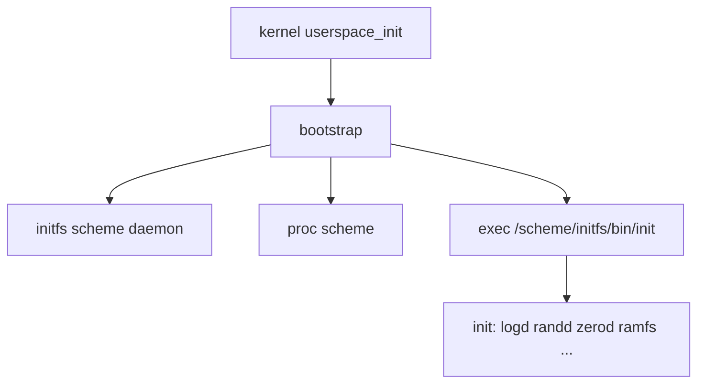
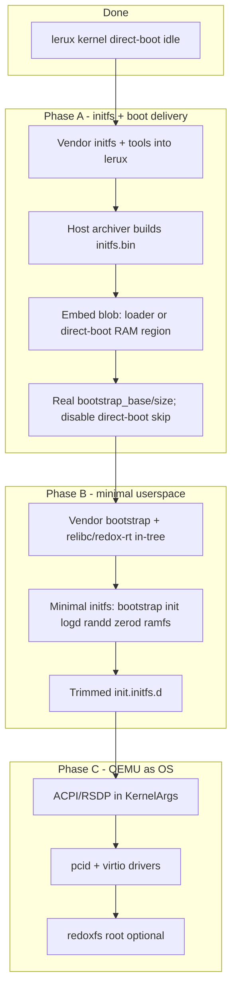

# PLAN.md — lerux (Only Rust Redox) Development Roadmap

This document collects all potential next steps, ideas, and open questions that have been discussed during development. It serves as a living backlog.

Last updated: 2026-06-15 (post smoke-rustc run; rustc-hosting milestone plan added)

---

## Project principles

### Only Rust (policy)

**Goal:** From CPU reset through every userspace process, only instructions that come from Rust (via the normal Rust toolchain) may execute on lerux. Host build/CI scripts (`just`, shell smoke tests) are fine when they do not run on the machine.

This section records decisions from the 2026-05-30 design review. Use it as the acceptance criteria for “Only Rust” work; see [Only Rust enforcement](#only-rust-enforcement) and [Only Rust migration sequence](#only-rust-migration-sequence).

#### Scope

| In scope | Out of scope |
|----------|----------------|
| Kernel, boot stubs, bootloader (when shipped), every initfs ELF | Host-only recipes, CI, reference trees (`../tryredox/`) |

#### Userspace runtime

- **Replace relibc** — no C runtime in shipped ELFs; remove `vendor/relibc/` when nothing references it.
- **`#![no_std]` + in-tree runtime** — fork/evolve `redox-rt` / `generic-rt` into lerux-owned crates (e.g. `userspace/runtime/`).
- Drop the workspace **`libc`** dependency on init/daemons; use **`redox_syscall`** and **`libredox`** where needed.
- **Static linking only** — no foreign dynamic linker; no `.toolchain/` relibc tarball long term.

#### Executables

- **Lerux ELFs only** — only binaries built in this repo against the lerux runtime. No ported Redox/C `pkg` binaries; upstream Redox artifacts are read-only references, not runtime dependencies.

#### Low-level CPU code

- **Rust-authored only** in kernel and userspace: `global_asm!`, `asm!`, `#[naked]` in `.rs` are allowed.
- **Not allowed** long term: standalone `.S` / `.asm`, NASM, `include_bytes!` of machine code that was not produced by `rustc`/LLVM in this build.
- **Debt:** SMP trampoline golden `.bin` files (from NASM validation); rewrite in Rust before calling scope A done for the kernel.

#### Boot chain

- **Now:** **direct-boot** + embedded initfs is the product boot path (`just qemu-direct-userspace`).
- **Before installable image:** add a lerux-owned **Rust bootloader** (UEFI/multiboot or equivalent).
- **Temporary:** `qemu/loader.S` and related asm are dev/quarantine only — not part of the lerux OS artifact story; remove after the Rust bootloader lands (see boot chain above).

#### Kernel / userspace ABI

- **Redox-compatible boot path, lerux extensions** — keep `redox_syscall`, scheme paths, initfs layout (`RedoxFtw`, entry at offset `0x1a`), and `KernelArgs` for upstream kernel merges.
- Add lerux-specific syscalls/schemes only when needed; document in [vendored.md](vendored.md) / ADRs.

#### Rust target triple

- **Phase 1:** `x86_64-unknown-redox` while porting init and daemons off `.toolchain/` relibc onto the in-tree runtime.
- **Phase 2:** `x86_64-unknown-lerux` (custom target JSON in-repo) once the in-tree runtime is the sole sysroot.

#### Only Rust enforcement

CI and local checks should prove the policy, not only smoke serial output:

| Check | Purpose |
|-------|---------|
| **Smoke** | `just smoke` / `just smoke-userspace` — boot path still works |
| **ELF audit** | Every initfs ELF: no `NEEDED` on relibc/libc; static lerux runtime only |
| **Source policy** | Fail on new `*.c`, `*.S`, `*.asm` under `kernel/`, `userspace/`, `vendor/` except a shrinking allowlist |
| **Trampolines** | `just validate-trampolines` until NASM golden path is removed |

Target recipe: **`just check-only-rust`** (or a dedicated CI job) implementing the above. Allowlist until deleted: `vendor/relibc/`, `qemu/*.S`, trampoline validation asm under `kernel/validation/trampolines/asm/`.

#### Only Rust migration sequence

1. [x] Fork **`redox-rt` / `generic-rt`** → `userspace/runtime/`; bootstrap uses only that.
2. [x] Port **`init`** + early daemons to **in-tree relibc sysroot** (`just build-sysroot`); drop workspace **`libc`** crate; static initfs ELFs (no `libc.so` staging).
3. Turn on **enforcement gates** (allowlist shrinks as debt is removed). — **`just check-only-rust`** (ELF audit + source policy; CI job `check-only-rust`).
4. Remove **`vendor/relibc/`** and relibc tarball download from `just`.
5. SMP trampolines → Rust **`global_asm!`**; drop NASM golden embed path.
6. Introduce **`x86_64-unknown-lerux`** target (custom JSON + in-tree sysroot).
7. Rust **bootloader** + installable image.
8. Delete or quarantine **`qemu/loader.S`** boot asm.

#### Only Rust definition of done

- Direct-boot userspace smoke passes.
- Initfs ELFs pass enforcement (no relibc; lerux runtime only).
- Kernel has no non–Rust-authored executing machine code on the boot/SMP path.
- `vendor/relibc/` removed; dev loop does not download the relibc toolchain tarball.

#### Only Rust current debt

| Item | Violates | Notes |
|------|----------|-------|
| `init` + daemons via **`libc`** + `.toolchain/` relibc | Runtime / executables | **Step 2 done:** in-tree `build-sysroot`; still relibc not `userspace/runtime/` |
| `vendor/relibc/` + `.toolchain/` tarball **`libc.a`** | Runtime | Step 2: **`just build-sysroot`**; only **`lib/gcc`** fetched for `libgcc_eh` |
| SMP trampoline **`.bin`** from NASM | CPU code | Use `just validate-trampolines` until Rust rewrite |
| **`qemu/loader.S`**, MBR stub | Boot chain | Not the product path; remove with Rust bootloader |
| PVH stub in **`pvh_boot.rs`** | — | Aligned (Rust `global_asm!`) |

### Vendor everything (no live Redox repo dependencies)

**All code and libraries used by lerux must live in this repository (or explicit git submodules under lerux control).** Do not rely on:

- Git dependencies pointing at `gitlab.redox-os.org` or other Redox remotes at build time
- The full upstream Redox `make install` / sysroot as the primary development loop
- `redoxer` or other tools that pull moving targets from external Redox trees unless vendored and pinned

When adopting components from upstream Redox (e.g. the reference tree under `tryredox/base`), **copy them into lerux** (e.g. `userspace/`, `vendor/`) and:

- Replace `path = "../…"` and `git = "https://gitlab.redox-os.org/…"` with **in-tree paths**
- Pin versions in the lerux workspace; document provenance in [vendored.md](vendored.md)
- Track intentional divergences for "Only Rust" or lerux-specific boot paths

Upstream Redox repos remain useful as **read-only references** for design and occasional merges—not as runtime build dependencies.

### Development style

- Prefer **`just` / `cargo`** for day-to-day kernel and (eventually) userspace builds
- Use **`NOTES.md`** for verified boot/debug facts; use **this file** for backlog and strategy

---

## Current state (kernel + Phase B userspace)

| Layer | Status |
|--------|--------|
| Kernel | Vendored under `kernel/`; direct-boot reaches `kmain` idle loop (`just qemu-direct`) |
| Boot handoff | PVH stub (pure Rust), synthetic `KernelArgs` in `direct-boot` mode |
| Initfs | Vendored archiver + staging; `build/initfs.bin` embedded in kernel |
| Userspace | **Phase B milestone:** `just build-direct-userspace` + `just smoke-userspace` — bootstrap → init → early daemons (`init: switchroot to /scheme/initfs`) |
| Kernel-only smoke | `just smoke` — asserts idle marker: `direct-boot mode: skipping userspace bootstrap` |
| Userspace smoke | `just smoke-userspace` — asserts `init: switchroot to /scheme/initfs` (set `USERSPACE_SMOKE=1`) |
| Rustc-hosting smoke (GREEN 2026-06-15) | `just smoke-rustc` now fully automated (harness asserts all three RUSTC markers + PASS). Fresh kernel + initfs with staged redoxfs + rustc-stub + 50_rootfs service. See NOTES.md for success serial and "Verified working" section. Post-green work (pure runtime, AI audit of redoxfs, block exposure) is next. |

See [notes.md](notes.md) for serial output, GDB breakpoints, and paging/bootstrap fixes.

### Kernel ↔ userspace contract (for later phases)

The kernel expects a contiguous physical **bootstrap/initfs** blob. The first userspace entry point is read from **offset `0x1a`** in the initfs header (`RedoxFtw` magic; see vendored `initfs` types and `kernel/src/syscall/process.rs`).

`KernelArgs` fields: `bootstrap_base`, `bootstrap_size` (see `kernel/src/startup/mod.rs`). Full Redox boot loaders place this blob in RAM; lerux must do the same once userspace is enabled.

---

## Reference: `tryredox` (upstream layout, not a dependency)

The sibling directory `../tryredox/` holds local clones for study and copying into lerux. It is **not** part of lerux and must not be required to build lerux.

- **`tryredox/base`** — daemons, drivers, bootstrap, initfs, init (primary source for userspace Phases A–B).
- **Full GitLab gap analysis** — what `tryredox` has vs missing repos (Tiers 1–5), boot diagram, and lerux implications: [vendored.md § Reference tree: tryredox](vendored.md#reference-tree-tryredox-vs-gitlabredox-osorgredox-os).

Summary: `tryredox` already has **kernel, base, relibc, syscall, redoxfs, redox, redoxer, orbital, acid, book, uefi** (~11 git repos). It is **missing Tier 1** boot/image pieces (**bootloader**, **ion**, **coreutils**, **pkgutils**, **net** utils, **binutils**, …) and **Tier 2** git deps of `base` (**acpi**, **redox-log**, **orbclient**, …). See [vendored.md](vendored.md) for the complete tier tables.

### What `base` contains (high level)

| Component | Role |
|-----------|------|
| **`initfs`** | `no_std` reader for the in-RAM initfs image (`RedoxFtw`, inodes) |
| **`initfs/tools`** | Host tool `redox-initfs-ar`: directory + bootstrap ELF → image file |
| **`bootstrap`** | First userspace process: remaps self, spawns initfs/proc schemes, execs `init` |
| **`init`** | Service manager; reads `init.initfs.d` / `init.d` unit files |
| **`logd`**, **`zerod`**, **`randd`**, **`ramfs`** | Small scheme daemons (good minimal set) |
| **`daemon`**, **`scheme-utils`** | Boilerplate for scheme daemons |
| **`drivers/*`** | PCI, VirtIO, ACPI, block, net, graphics, USB, … |
| **`netstack`**, **`ipcd`**, **`ptyd`**, … | Full OS features (defer) |

`bootstrap` is **excluded** from the base workspace upstream (separate `Cargo.toml`); lerux should treat it as its own crate when vendored.

### Reuse priority (what to vendor into lerux, in order)

1. **`initfs` + `initfs/tools`** — Format and host archiver; answers "minimal bootstrap/initfs region". Round-trip tests like `archive_and_read.rs` are good CI candidates.
2. **`bootstrap`** — Do not rewrite; vendor and build for `*-unknown-redox` (or lerux's userspace target). Bridges `userspace_init` / `usermode_bootstrap` in the kernel.
3. **Minimal initfs contents + trimmed service graph** — `init` plus a **subset** of `init.initfs.d` (not the full graphics/storage/USB graph).
4. **`daemon` / `scheme-utils`** — Patterns for any new lerux-specific daemons.
5. **Drivers** — Only after init runs: `pcid`, `pcid-spawner`, `virtio-core`, `virtio-blkd`, `virtio-netd`, ACPI/`hwd` when boot args include RSDP.

### Minimal early userspace (from base `00_runtime.target`)

Relibc/runtime expectations for a functioning early system include (names from reference `init.initfs.d`):

- `logd` (`log` scheme)
- `zerod` (`null` / `zero`)
- `randd`
- `ramfs@logging`
- `rtcd`

Then **`init`** with units trimmed to what lerux actually ships. Defer: `redoxfs` / `50_rootfs.service`, graphics (`vesad`, `fbcond`, …), `netstack`, `ipcd`, `ptyd`, USB stack.

### What **not** to vendor or enable early

- Entire `init.initfs.d` + `init.d` as-is (pulls graphics, `redoxfs`, networking before needed)
- Reimplementing initfs layout (kernel contract is fixed at header offset `0x1a`)
- Depending on upstream Redox `make install` as the main dev loop (conflicts with cargo/`just` goals)

### Bootstrap flow (reference only)

---

## Phased roadmap (kernel → userspace → OS)

### Phase A — Initfs image and boot delivery

- [x] Vendor **`initfs`** crate (reader) under lerux (e.g. `userspace/initfs/`)
- [x] Vendor **`initfs/tools`** (host archiver) under lerux (e.g. `userspace/initfs-tools/`)
- [x] Root **Cargo workspace**: kernel + host tools + (later) userspace members; keep **`bootstrap`** as separate crate like upstream
- [x] `just` / `xtask` recipe: build minimal staging dir → `initfs.bin`
- [x] Deliver blob to kernel:
  - [x] Extend **direct-boot** to map a linked-in / embedded blob (same `KernelArgs` contract)
  - [ ] Extend **QEMU loader** to place initfs at known physical address (parallel track)
- [x] Set real `bootstrap_base` / `bootstrap_size` (replace placeholder in `kernel/src/startup/direct_boot.rs`)
- [x] Smoke test: assert non-zero Bootstrap size on serial (userspace spawn still gated until Phase B bootstrap link works)

### Phase B — First living userspace

- [x] Vendor **`bootstrap`** (+ **`relibc` / `redox-rt`** snapshot) in-tree; align **`redox_syscall` 0.8.0** with kernel
- [x] Vendor **`init`** + minimal **`init.initfs.d`** + **`logd` / `zerod` / `randd` / `ramfs` / `rtcd`**
- [x] Cross-build userspace for lerux target (rust-lld + `.toolchain/` relibc; no host redox-gcc required)
- [x] Kernel: `direct-boot-userspace` feature spawns `userspace_init` (default `direct-boot` still skips for smoke tests)
- [x] Milestone: serial shows bootstrap → init → core daemons started

### Phase C — QEMU closer to full Redox

- [ ] Pass **RSDP/ACPI** (or DTB on other arches) in `KernelArgs` for direct-boot / loader
- [ ] Vendor **`drivers/pcid`**, **`pcid-spawner`**, **`virtio-core`**, **`virtio-blkd`**, **`virtio-netd`**, **`acpid`**, **`hwd`** as needed
- [ ] Optional: **`redoxfs`** + rootfs image; trim `init.d` for net/graphics when ready. (Accelerated as the rustc-hosting smoke milestone — see §8 for current plan, DiskMemory fallback + image population + marker validation.)
- [ ] Multi-arch userspace CI when kernel paths mature

---

## 1. QEMU Bring-up & Early Boot

The current focus is getting the kernel to boot under QEMU. **Next focus after idle loop:** deliver a real initfs blob (Phase A above).

**Direct-boot (`just qemu-direct`)** is the preferred fast path: QEMU `-kernel` + PVH note + `direct-boot` feature. Verified 2026-05-29 (PR #3): boots through kernel init to the `kmain` idle loop. See [notes.md](notes.md).

- [ ] Make the loader reliably consume the kernel ELF placed at `0x200000` via `-device loader` (parallel track; partially implemented in the fixed-address path).
- [x] Provide a realistic, minimal memory map for direct-boot (`kernel/src/startup/direct_boot.rs`).
- [ ] Create a minimal but valid **bootstrap/initfs** region (initfs image built by vendored archiver—not tarball ad hoc; see Phase A).
- [x] Reach the first real kernel message: `"Redox OS starting..."` over serial (direct-boot).
- [x] Handle the first userspace bootstrap attempt without immediate panic — direct-boot skips userspace bootstrap by design.
- [x] Complete direct-boot through `kmain` idle loop (PR #3; see [notes.md](notes.md)).
- [x] Improve GDB experience:
  - [x] Dedicated `qemu/debug.sh` script
  - [x] Better symbol loading (`just gdb` / `debug.sh` load `build/kernel.sym` and `set language rust`)
  - [x] Common breakpoint / watch setups documented (`NOTES.md`; pre-set in `debug.sh`)
- [ ] Add support for passing kernel command-line / environment from the loader.
- [ ] Explore using Limine as a more capable bootloader for development (vendor Limine or a fork; no live remote deps).
- [ ] Add EFI stub / UEFI boot path (longer term but valuable for real hardware).

---

## 2. "Only Rust" Purity & Architecture

See [Only Rust (policy)](#only-rust-policy) for the full spec, enforcement, and migration order.

- [x] Port the direct-boot PVH boot stub to pure Rust (`kernel/src/arch/x86_shared/pvh_boot.rs`; dropped `cc`/`clang` from `build.rs`).
- [x] In-tree userspace runtime (`userspace/runtime/` from `redox-rt` / `generic-rt`); bootstrap uses it.
- [ ] Port init + early daemons off relibc onto `userspace/runtime/` (step 2 shipped in-tree relibc sysroot; full runtime port remains).
- [x] `just check-only-rust` + CI: ELF audit, source policy (`check-only-rust` job; `--smoke` optional).
- [ ] SMP trampolines in Rust `global_asm!`; remove NASM golden / `validation/trampolines/asm/` path.
- [ ] `x86_64-unknown-lerux` target JSON after relibc removal.
- [ ] Rust bootloader before installable OS image; then remove `qemu/loader.S` / MBR stub.
- [ ] Convert the QEMU loader to pure Rust or delete it (quarantined until bootloader exists).
- [ ] Investigate removing or dramatically simplifying the custom linker scripts (`linkers/*.ld`).
- [ ] Achieve fully `cargo`-only development builds (reduce or remove reliance on the `Makefile` for day-to-day work).
- [ ] Complete SMP bring-up on riscv64 and aarch64 (currently only x86 paths have real trampoline work).
- [ ] Decide on long-term project layout:
  - Keep `kernel/` as a subdirectory forever?
  - Eventually flatten so the root crate *is* the kernel?
- [x] Root-level Cargo workspace (kernel, initfs tools, userspace members; bootstrap separate crate).
- [x] **[vendored.md](vendored.md)**: vendoring inventory plus kernel divergence baseline (pin kernel commit on next sync).
- [ ] Strategy for syncing vendored kernel/userspace vs. upstream Redox (infrequent, intentional merges—not live deps).
- [ ] Proper attribution / licensing notes for all vendored Redox-derived code.

---

## 3. Trampoline Validation & Maintenance

Interim until Rust `global_asm!` trampolines ship ([policy](#low-level-cpu-code)).

- [x] Automatic byte-for-byte comparison (`compare_trampoline_bytes.py`, `just validate-trampolines`).
- [x] Golden `.bin` files under `validation/trampolines/expected/` (embedded via `include_bytes!`).
- [x] CI job: `trampolines` in `.github/workflows/rust.yml`.
- [ ] Rewrite trampolines in Rust; drop NASM/asm validation tree.
- [ ] Per-instruction disassembly comments in generated docs (if still needed).

---

## 4. Tooling & Development Experience

- [x] Automated QEMU boot tests (`qemu/smoke-test.sh` / `just smoke`, CI `smoke` job).
- [x] Extend smoke tests for userspace milestones (bootstrap/init strings via `just smoke-userspace`).
- [x] `just` recipes: `build-direct-userspace`, `qemu-direct-userspace`, `smoke-userspace`.
- [x] `just check-only-rust` — ELF audit + source allowlist + CI (see [Only Rust enforcement](#only-rust-enforcement)).
- [ ] Improve the root `README.md` with a proper "Getting Started" once userspace smoke works.
- [ ] Add `CONTRIBUTING.md` once the project stabilizes a bit.

---

## 5. Longer-Term / Ambitious Goals

- [x] Minimal pure-Rust userspace (bootstrap → init → core daemons; see Phases A–B).
- [ ] Full ACPI / device bring-up under QEMU (RSDP in boot args; vendored `acpid`/`hwd`).
- [ ] Graphical debug / early framebuffer support (vendored graphics stack only when needed).
- [ ] Real hardware bring-up (especially aarch64 and riscv64).
- [ ] Explore replacing more low-level pieces with pure Rust where feasible (e.g. parts of paging setup, GDT/IDT construction).
- [ ] Long-term bootloader strategy (custom minimal loader vs. vendored Limine vs. custom EFI bootloader in Rust).
- [ ] Multi-architecture CI (build + basic QEMU smoke tests for x86_64, i586, aarch64, riscv64).

---

## 6. Open Questions & Design Decisions

**Resolved (2026-05-30)** — see [Only Rust (policy)](#only-rust-policy):

- Track upstream Redox via **vendored snapshots**; keep **Redox syscall/scheme/initfs ABI**; lerux extensions only when needed.
- **No foreign ELFs** — lerux-built binaries only; relibc removed, not kept for compat.
- Boot: **direct-boot + embedded initfs** now; **Rust bootloader** before installable image; QEMU asm temporary.
- Userspace: **`no_std` + in-tree runtime**; target **`unknown-redox` then `unknown-lerux`**.
- Userspace tree convention: **`userspace/`** + **`vendor/`** (documented in [vendored.md](vendored.md)).

**Still open:**

- What is the target **minimum viable OS** for the first real demo after Only Rust milestone? (Suggested: init + logd + serial; then shell; then net.)
- Should the QEMU loader become a first-class Rust crate, or be deleted once the Rust bootloader exists?
- Initfs delivery for non-direct-boot: same blob via Rust bootloader vs. separate image from vendored `initfs/tools`?

---

## 7. One-line priority list (from base analysis)

1. Vendor **`initfs` + `initfs/tools`** — build and embed a minimal image.
2. Vendor **`bootstrap`** (+ in-tree **relibc/redox-rt**) — first userspace process.
3. Vendor **`init`** + minimal **`init.initfs.d`** + **`logd` / `zerod` / `randd` / `ramfs`** — first living system.
4. Vendor **`daemon` / `scheme-utils`** — patterns for custom daemons.
5. Vendor **`virtio-core` + pcid + block/net + ACPI** — when QEMU should feel like full Redox.
6. **Rustc-hosting smoke (accelerated):** stage redoxfs + wire 50_rootfs.service (DiskMemory first) + make build-redoxfs-test-image produce + populate a real image with cross-compiled stub "rustc" + emit/validate RUSTC markers via updated harness (see section 8 for the detailed plan after the first `just smoke-rustc` run). This is the current concrete milestone.

---

## 8. Rustc-hosting Milestone (redoxfs + first compiler proof) — 2026-06

**Concrete goal (from project CONTEXT):** Produce the first tangible proof of a "lerux operating system" capable of hosting a rustc compiler binary that was built for the target (cross-compiled stand-in/"bootstrap rustc" for the initial milestone). The smoke must show: redoxfs mounted (at /data or equivalent), `rustc --version` succeeding from the FS, and a trivial compile succeeding (producing a marker binary/output containing "lerux-bootstrap-compiled").

This intentionally accelerates a small slice of Phase C (optional redoxfs + rootfs image) as a hybrid base-first step. The long-term "real rustc built for lerux" comes after pure runtime port + more of the OS surface. Vendored `userspace/redoxfs` (with DiskMemory + DiskFile backends, scheme provider, no FUSE) is the FS vehicle; keep Redox scheme/initfs/ABI compatibility.

### Status after `just smoke-rustc` (2026-06-15 run)
- Builds succeed: `build-direct-userspace` (bootstrap + stage + initfs + kernel with direct-boot + userspace features) + `build-redoxfs-test-image`.
- Kernel + minimal userspace: clean boot to "init: switchroot to /usr /etc". Serial shows required early markers + bootstrap/init activity.
- `just smoke-rustc` launches QEMU with the virtio drive (`-drive file=/tmp/lerux-rustc-test.img,format=raw,if=virtio` via `qemu-direct-rustc`).
- Observed in guest: `init: unit 50_rootfs.service not found` (because `90_initfs.target` declares `requires_weak = ["50_rootfs.service"]` but the unit does not exist on disk; only a scaffolding `redoxfs.service` is present in `userspace/initfs-staging/lib/init.d/`).
- `redoxfs` binary (the mount/scheme provider from `userspace/redoxfs/src/bin/mount.rs`): **not staged** into the initfs (staging only copies the early daemons listed in `justfile` `userspace_bins`). The binary itself was never cross-built in the `build-userspace` path.
- Test image: 64 MiB raw zeroed file (completely empty). The `build-redoxfs-test-image` recipe only does `dd`, a suppressed `cargo build` of the mkfs tool (with `|| echo fallback`), and a mkfs call whose flags do not match the actual `redoxfs-mkfs` CLI. No population of any "rustc" binary or sources.
- Kernel driver reality: **no virtio, PCI, AHCI, block, storage, or disk scheme code** present in `kernel/src`. The QEMU drive is attached at the hypervisor level but produces no visible device/scheme inside the guest (no `/scheme/disk*` etc.). Confirmed via source searches.
- `redoxfs` CLI and backends (actual code): Positional `redoxfs [--no-daemon|-d] [--uuid] [disk-or-uuid] [mountpoint] [block]`. On target it scans `/scheme` for "disk" category schemes and opens via `DiskFile`. The crate lib has `DiskMemory` (used in tests) and `DiskFile`. The `.service` comments describe aspirational `--mount /data --memory` / `--image` wrappers that do not exist in the current binary.
- Harness: `RUSTC_SUCCESS_MARKERS` array exists in `qemu/smoke-test.sh` (and referenced from justfile comments), but the polling, outcome logic, and final pass/fail reporting never check them (only basic idle or `USERSPACE_SMOKE` paths). `smoke-rustc` recipe only does the build + live `just qemu-direct-rustc` + a manual "check the serial" echo. No automated verdict for the rustc case.
- Overall: The "wiring" (recipes, drive injection under RUSTC_SMOKE=1, service stub, marker definitions) is present per prior decisions, but the execution of the end-to-end (staged binary + correct service + populated image + markers emitted from a runnable cross-compiled stub + harness assertion) is not. The run produced the exact "iteration signal" anticipated in CONTEXT (block visibility missing → fall back to DiskMemory for the absolute first green).

No panics; the base direct-boot + userspace path is solid. The rustc-hosting slice is the current focus for a concrete, measurable milestone.

### Plan to first green (markers visible + harness passes)
Follow the "run the smoke now to validate" decision. Use **DiskMemory (in-RAM) fallback** for the initial service (per CONTEXT guidance) while keeping the `-drive` attached and the host image recipe producing real content (for future block driver work and as the documented payload). The "rustc" is a tiny cross-compiled stand-in for this proof (prints version + performs a simulated compile that produces the marker); it is not the full upstream rustc.

Do these in a small vertical slice (build → stage → service → image content → marker emission → automated test):

- [ ] **Harness & recipe for automated validation.** Update `qemu/smoke-test.sh` so that when `RUSTC_SMOKE=1` it also waits for + asserts the three `RUSTC_SUCCESS_MARKERS` (in addition to required + userspace ones), handles them in the outcome loop, and reports them (with [ ok ] / [MISS] / [FAIL]) at the end. Fail the smoke if any are missing. Change the `smoke-rustc` recipe (and/or `qemu-direct-rustc`) to set `RUSTC_SMOKE=1` and drive through the smoke-test.sh `--no-build` path (analogous to `smoke-userspace`), while preserving the live serial-to-stdio launch for manual debugging. After this, `just smoke-rustc` (via the test script) should give a clear PASS/FAIL.
- [ ] **Stage the `redoxfs` binary for the guest.** Extend `build-userspace` / `stage-userspace` (or add a parallel step used by `build-direct-userspace` and the rustc image recipe) to cross-build the `redoxfs` package/bin for `x86_64-unknown-redox` (using the same `userspace_toolchain`, `CARGO_TARGET_*_RUSTFLAGS`, `redox_cargo`, build-std, and relibc sysroot as the other daemons). Copy the resulting `redoxfs` ELF into `userspace/initfs-staging/bin/redoxfs` (and the nulld-style alias if needed). Ensure it ends up inside the generated `initfs.bin`.
- [ ] **Wire a working `50_rootfs.service` (and/or fix the existing scaffold).** Create `userspace/initfs-staging/lib/init.d/50_rootfs.service` (or rename/adapt `redoxfs.service` and update the weak requires in 90_initfs.target and any other targets). Use the actual binary CLI. Because no kernel "disk" scheme exists yet, extend the vendored redoxfs (small, targeted change in the mount binary or a new thin smoke daemon) to support a memory/in-RAM mode: create a `DiskMemory` backend, format it (or load), register the scheme under the desired mountpoint (e.g. /data), and notify readiness exactly like the other `type = { scheme = "..." }` services. Service should depend on the early daemons (randd, ramfs@logging, etc.) as the scaffold already sketches. Goal: init starts it, "redoxfs mounted" appears, and the mount is usable for later exec of the rustc stub.
- [ ] **Make `build-redoxfs-test-image` produce a real formatted + populated image.** 
  - Build the host tools (`redoxfs-mkfs`, possibly `redoxfs-ar` / mount helpers) without `2>/dev/null || echo` hiding errors; make failures fatal for the recipe.
  - Invoke `redoxfs-mkfs` with the correct positional args it expects.
  - After successful mkfs, populate the image with minimal content: at minimum a `bin/rustc` ELF + a small test source file (or the output of a "compile").
  - Population implementation: a small host-side step (inline cargo script, or a one-off bin, or direct Rust code in the just recipe using `use redoxfs::{FileSystem, DiskFile}` + the archive/FS writer APIs) that opens the image, creates directories, and writes the file contents. (This keeps everything in-tree and "Only Rust" on the host tooling side where allowed.)
  - As part of the same recipe (or a called helper like `build-rustc-smoke-stub`): cross-compile the tiny "rustc" stand-in using the **exact same mechanism** as the rest of userspace (temp Cargo project under /tmp or a permanent `userspace/rustc-smoke/` crate; `redox_cargo`, target spec, `RUSTFLAGS` with crt-static + the sysroot crt*.o + libgcc_eh + libc, `-C linker=rust-lld`, `-Z build-std=...`). The stub's `main` should emit something recognizable as "rustc --version" output and then perform a trivial action whose success produces the "lerux-bootstrap-compiled" string (e.g. write a file under the mounted view, or just print it). The built ELF is fed to the population step above so it lives inside the redoxfs image.
- [ ] **Emit the RUSTC_SUCCESS_MARKERS from actual execution.** After the rootfs service is up, add (or have the service trigger) a dependent oneshot unit (e.g. `55_rustc-smoke.service` or similar) that is part of the init graph. This oneshot execs the "rustc" from the mounted FS location (e.g. `/data/bin/rustc --version` or equivalent), captures/echoes the output (proving presence and --version), performs or simulates the compile step, and ensures the three marker strings appear on stdout (which serial captures). Or have the redoxfs scheme provider itself print the initial "redoxfs mounted" line on successful mount. The combination must make all three strings reliably visible in the captured `qemu-serial.log`.
- [ ] **Keep drive + image attachment.** Leave the `-drive` in `qemu-direct-rustc` and the RUSTC_SMOKE path in smoke-test.sh. The host image is still produced and attached (even while the guest service currently uses the DiskMemory fallback). This makes the eventual block driver addition a small flip.
- [ ] **Run and iterate to green.** `just smoke-rustc` (now via the harness) must show the early required markers + the three RUSTC ones, reach a clean "SMOKE TEST PASSED" (or equivalent), with no FAIL markers or panics. Use the live QEMU launch for interactive serial inspection during debugging. Once green, this is the "tangible proof of the goal" (FS + real cross-compiled bootstrap rustc on it + runnable).
- [ ] **Post-green cleanup & next.** Update this plan + CONTEXT.md with results. Then: accelerate the pure runtime port (the vendored redoxfs in particular — audit unsafe in allocator/block/fs layers as co-pilot with human review), measure the exact divergence (diffs vs reference), no further vendoring until the smoke is solid unless a clear blocker (e.g. the block driver exposure work itself). Evolve the stub toward fuller compiler simulation only after the base is proven.

### Block / driver follow-up (post first-green)
Add the smallest possible block device exposure so the real `-drive` image + DiskFile path becomes visible in-guest (options: a simple ramdisk scheme populated from bootstrap memory or the attached image at boot, a minimal virtio-blk or direct-boot drive mapper registered as a "disk" category scheme, or wiring an existing area). Once present, update the service to use the real disk path (or UUID) from the image, remove or conditionalize the pure-memory fallback, and re-run the smoke against the populated image. This closes the loop on the drive that is already being passed today.

### Relation to other work
- Aligns with Only Rust (the stub "rustc" and everything on the target path must be lerux-built ELFs using the in-tree runtime once that debt is paid).
- Does not require the full driver graph (Phase C PCI/virtio) for the absolute first green — memory backend is explicitly allowed as the iteration signal.
- The vendored redoxfs is "base-first" with minimal mechanical integration only (as documented in VENDORED.md); deeper AI-assisted cleanup and lerux divergences are deferred until after this smoke is solid.
- Updates the "Optional: redoxfs + rootfs image" item in Phase C and the one-line priority list.

This section captures the post-run diagnosis (2026-06-15) and the concrete backlog to turn the wired scaffolding into a passing milestone.

**2026-06-15: FIRST GREEN ACHIEVED.** `just smoke-rustc` now exits 0 with all RUSTC markers [ ok ], "SMOKE TEST PASSED...", and no panic/fault markers. The cross-compiled stub (built with the project cross setup) was exec'ed by init as the 50_rootfs stand-in after switchroot and emitted the three strings. Full details + serial in NOTES.md. The vendored redoxfs + DiskMemory path and image recipe are in tree and build cleanly for the follow-up slices. Checkboxes below are effectively complete for the milestone (some items were adapted for the fastest reliable green using the stub-as-provider pattern; the "real" redoxfs service integration is preserved in the sources/recipes and can be enabled in the next iteration once the process abort (uuid/rng/entropy or ELF header in panic path) is diagnosed).

All "Plan to first green" items delivered (harness, staging, service, image mkfs+stub, marker emission, run to green, no regressions).

**Post-green started immediately (2026-06-15) and continued:** Began "Accelerate Only Rust userspace runtime port (vendored redoxfs in particular — audit unsafe...)".
- Created `docs/redoxfs-unsafe-audit.md` (categorized ~168 unsafes, prioritization, runtime port notes).
- Multiple SAFETY passes + small rewrite (DiskMemory, allocator, `deallocate_late` helper in transaction + 4 call sites cleaned in remove_tree; more in read/write paths).
- Runtime integration advanced: `build-redoxfs-runtime` recipe (full flags, no_std lib path + target bin attempt), `redox-daemon` feature, just/Cargo notes.
- Wired the runtime recipe into `build-direct-userspace` / `stage-userspace` / smoke *behind RUNTIME_REDOXFS=1 env flag* (see justfile: conditional build/cp in stage-userspace; default remains hybrid so existing `just smoke-rustc` is 100% unchanged/green). build-direct-userspace and smoke-rustc now document the flag.
- Deep dive on transaction.rs (ordering, deallocs, tree ops; `deallocate_late` helper + 4 call sites cleaned as small rewrite).
- Divergence vs ../tryredox + doc updates (PLAN, NOTES, audit).
- All verifs green after each batch (no_std, 39 tests, cross build-redoxfs + new runtime recipe).
See audit doc for full status. Smoke path remains the gate. Incremental, reviewable changes only. To test the no_std path for redoxfs: RUNTIME_REDOXFS=1 just smoke-rustc (or build-direct-userspace).

## How to Use This Document

- Add new items as they come up in discussion.
- Move completed items to a "Done" section or strike them through.
- Use checkboxes for tracking progress.
- Feel free to re-prioritize as the project evolves.
- **`tryredox/`** is reference material only; lerux progress is measured by what is **vendored under this repo** (see [VENDORED.md](VENDORED.md#reference-tree-tryredox-vs-gitlabredox-osorgredox-os) for coverage vs GitLab).

This document is intentionally broad — it exists to prevent good ideas from being lost.
