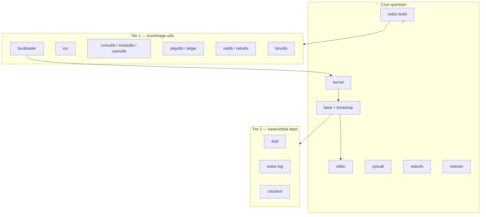

# VENDORED.md — Third-party and upstream code in lerux

This file tracks code copied into lerux from upstream projects (especially Redox), how it differs from upstream, and what still depends on external registries. See [plan.md](plan.md) for the **vendor everything** policy: no build-time dependencies on Redox GitLab or other moving upstream trees.

**Convention:** vendored trees live under `kernel/`, `userspace/`, or `vendor/` (pick one layout per import; document each row below). The `vendor/` directory now consolidates the pristine upstream Redox kernel source snapshot plus all crate dependencies (and many transitives) of lerux as plain source trees. External reference trees are **not** part of lerux and are not listed here as vendored—only what is **in this repository**.

Detailed per-subdirectory vendoring dates, sources, and cleanup notes live in `vendor/README.md`.

---

## How to update this file

When you vendor a new component:

1. Copy sources into lerux (do not add `git = "https://gitlab.redox-os.org/…"` to lerux `Cargo.toml`).
2. Add a row to the table below with upstream URL, version or commit, license, and lerux path.
3. List **lerux-specific changes** (patches, features, deleted files).
4. If the import came from a reference checkout, record that commit in **Upstream revision** (or `TBD` until someone pins it).
5. For crates.io dependencies (or bulk via `cargo vendor`), place under `vendor/<name>-<ver>/` (or appropriate subdir). After mass vendoring, run cleanup: `rm -rf` any `.git` dirs to produce plain source trees; prune large/irrelevant crates (e.g. winapi-* Windows platform sources). Document per-subdir dates and details in `vendor/README.md`.
6. Update this file's tables (and the External dependencies section) and cross-reference `vendor/README.md`.

When syncing from upstream Redox, bump **Upstream revision**, re-apply lerux patches, and note the date in **Last synced**. Re-vendor the pristine snapshot to `vendor/redox-kernel/` if refreshing from reference.

---

## Kernel divergence from upstream (lerux patches)

Most of the working kernel tree at `kernel/` is unmodified Redox code (~2026-05 import, with subsequent updates). A pristine upstream snapshot of the Redox kernel source is also maintained as a plain source tree at `vendor/redox-kernel/` (see vendored table below). The items below are **intentional lerux changes** on top of upstream; re-check them on every kernel sync. Terminology: [docs/GLOSSARY.md](docs/GLOSSARY.md). Postmortem on an earlier trampoline mistake: [docs/trampoline-bytes-postmortem.md](docs/trampoline-bytes-postmortem.md).

### What stays the same

| Area | Status |
|------|--------|
| Syscall surface (`redox_syscall`, scheme handlers) | Unchanged |
| Memory manager (`kernel/rmm/`) | Unchanged |
| Boot strings and `sys:uname` | Still report **"Redox"** (not renamed to lerux) |

### Repository layout (lerux-only)

Upstream ships the kernel as the crate root. lerux wraps it: `Cargo.toml` and `build.rs` at the **repo root**, sources under `kernel/`, plus `justfile`, `qemu/`, `linkers/`, `targets/`.

### Code and build changes

| Change | Upstream | lerux |
|--------|----------|-------|
| SMP trampolines | `nasm` in `build.rs` | Same: `lerux-kernel/src/asm/*/trampoline.asm` → `OUT_DIR/trampoline` |
| PVH boot stub | `pvh_boot.S` + `cc` | Same: `lerux-kernel/src/arch/x86_shared/pvh_boot.S`; `direct-boot` feature only |
| Boot args | Redox bootloader supplies `KernelArgs` | `direct-boot` synthesizes args in `direct_boot.rs` for `qemu -kernel` |
| `build.rs` | nasm + cc on x86 | nasm for trampolines; cc/clang for `pvh_boot.S` when `direct-boot`; embeds `build/initfs.bin` when `direct-boot` |
| CI | Upstream GitLab | `.github/workflows/rust.yml`: fmt, clippy, check, **trampolines**, **initfs**, smoke |
| Userspace bootstrap | Always spawned from initfs | `direct-boot` skips spawn; `direct-boot-userspace` spawns when bootstrap ELF is in initfs |
| SSE for userspace | Upstream sets CR4 via boot path | `early_init` sets `CR4_ENABLE_SSE` (+ `CR4_ENABLE_OS_XSAVE` when XSAVE present) so bootstrap/init can use SSE |
| Direct-boot memory map | Static minimal map (assumed ~512 MiB) | Enlarged kernel reservation (0x0400_0000) + shifted free base to tolerate larger embedded initfs blob (redoxfs + stub + services for rustc-hosting smoke). See `kernel/src/startup/direct_boot.rs`. |

Building **without** `direct-boot` still targets a normal Redox-style kernel but expects the full Redox build system (see [building/standalone.md](building/standalone.md)).

---

## Vendored in-tree (lerux repository)

| Component | In-repo path | Upstream | Upstream revision | License | Last synced | Lerux-specific changes |
|-----------|--------------|----------|-------------------|---------|-------------|-------------------------|
| Redox kernel (working / adapted tree) | `kernel/` | [redox-os/kernel](https://gitlab.redox-os.org/redox-os/kernel) | `TBD` (initial import ~2026-05; pin commit on next sync) | MIT (`kernel/LICENSE`) | 2026-05 | Direct-boot PVH stub in Rust; SMP trampolines from NASM golden files (`include_bytes!`); `just validate-trampolines` + CI; `direct-boot` embeds initfs; `direct-boot-userspace` spawns bootstrap; no nasm/cc in kernel build |
| Pristine Redox kernel source (plain source tree) | `vendor/redox-kernel/` | [redox-os/kernel](https://gitlab.redox-os.org/redox-os/kernel) | Copied 2026-06-16 from reference checkout `~/repos/redox/redox_org/kernel` (matching vendored revision) | MIT | 2026-06-16 | Full upstream snapshot for reference / offline use. `.git` removed 2026-06-16 (plain source tree, no VCS metadata). Working adapted copy with lerux patches remains at root `kernel/`. Winapi crates pruned from broader vendoring in same cleanup. |
| Pristine Redox bootloader source (plain source tree) | `vendor/redox-bootloader/` | [redox-os/bootloader](https://gitlab.redox-os.org/redox-os/bootloader) | Copied 2026-06-17 from reference checkout `/home/julian/repos/redox/redox_org/bootloader` (commit 2a718991b3deb343746f2dbb0ee9b3e63a4c47d8) | MIT | 2026-06-17 | Full upstream snapshot for reference / offline use. `.git`, `.gitignore`, `.gitlab-ci.yml` and `.helix` removed (plain source tree). |
| RMM (memory manager) | inlined under `lerux-kernel/src/lerux-rmm/` (from vendor/redox-kernel/rmm) | Same kernel tree / [redox-os/rmm](https://gitlab.redox-os.org/redox-os/rmm) | `TBD` (bundled with kernel import) | MIT | 2026-06-16 (inlining) | Previously a path dep; now fully inlined (no Cargo dep) as `lerux-rmm` under the kernel src tree (original module name rebound via #[path] so kernel code is unchanged). Old top-level lerux-kernel/rmm/ cleaned up. |

**Zero Cargo dependencies for the kernel (2026-06-16 change)**: All former runtime crates from the root Cargo.toml (arrayvec, bitfield, bitflags, fdt, hashbrown + ahash, linked_list_allocator + spinning_top/lock_api/scopeguard, object + memchr, raw-cpuid, redox-path, redox_syscall (bound as "syscall"), rustc-demangle, slab, smallvec, spin, x86, plus the build-dep toml + its host closure serde*/winnow*/toml_edit* etc.) have been copied from their `vendor/*` snapshots and placed as plain source trees in `lerux-kernel/src/lerux-*/` (subdirectories under lerux-kernel/src with the requested lerux-* prefix). The kernel entry point binds the *original* module names via `#[path = "lerux-xxx/lib.rs"] mod original_name;` (and equivalent inside build.rs for the toml family), so the bulk of the kernel source requires no use-site changes. The root Cargo.toml now has no runtime [dependencies] (and no [build-dependencies] toml). The vendored originals in `vendor/` remain the reference snapshots (see also the dedicated `vendor/README.md` for per-subdir dates and the post-vendoring cleanup history). This achieves the "ZERO cargo dependencies" goal while preserving the Redox kernel logic and lerux adaptations.

| initfs (reader) | `userspace/initfs/` | [base/initfs](https://gitlab.redox-os.org/redox-os/base) | `TBD` (from upstream [redox-os/base](https://gitlab.redox-os.org/redox-os/base) 2026-05-30) | MIT | 2026-05-30 | Standalone crate in root workspace; `plain` from crates.io |
| initfs archiver (host) | `userspace/initfs-tools/` | [base/initfs/tools](https://gitlab.redox-os.org/redox-os/base) | `TBD` (from upstream [redox-os/base](https://gitlab.redox-os.org/redox-os/base) 2026-05-30) | MIT | 2026-05-30 | `redox-initfs-ar` / `redox-initfs-dump`; path dep to `userspace/initfs` |
| bootstrap | `userspace/bootstrap/` | [base/bootstrap](https://gitlab.redox-os.org/redox-os/base) | `TBD` (from upstream [redox-os/base](https://gitlab.redox-os.org/redox-os/base) 2026-05-30) | MIT | 2026-05-30 | Own `[workspace]`; `redox-rt` path to `userspace/runtime/redox-rt`; git dep removed |
| userspace runtime | `userspace/runtime/` | [relibc/redox-rt + generic-rt](https://gitlab.redox-os.org/redox-os/relibc) | `TBD` (from upstream [redox-os/relibc](https://gitlab.redox-os.org/redox-os/relibc) 2026-05-30) | MIT | 2026-05-30 | Lerux-owned `no_std` runtime; bootstrap links here; init/daemons still on `.toolchain` relibc until step 2 |
| relibc (partial) | `vendor/relibc/` | [redox-os/relibc](https://gitlab.redox-os.org/redox-os/relibc) | `TBD` (from upstream [redox-os/relibc](https://gitlab.redox-os.org/redox-os/relibc) 2026-05-30) | MIT / BSD | 2026-05-31 | Snapshot for init/daemon link; **`redox-rt` / `generic-rt`** bundled under `vendor/relibc/` for relibc build; **`userspace/runtime/`** used by bootstrap only; sysroot via **`scripts/build-sysroot.sh`**. `.git` removed 2026-06-16 (plain source tree). |
| init | `userspace/init/` | [base/init](https://gitlab.redox-os.org/redox-os/base) | `TBD` (from upstream [redox-os/base](https://gitlab.redox-os.org/redox-os/base) 2026-05-30) | MIT | 2026-05-31 | Static link via in-tree sysroot + `targets/x86_64-unknown-redox.json`; no workspace `libc` crate |
| logd, zerod, randd, ramfs | `userspace/{logd,zerod,randd,ramfs}/` | [base/*](https://gitlab.redox-os.org/redox-os/base) | `TBD` (from upstream [redox-os/base](https://gitlab.redox-os.org/redox-os/base) 2026-05-30) | MIT | 2026-05-30 | Minimal early daemons; staged into `initfs-staging/bin/` |
| rtcd | `userspace/drivers/rtcd/` | [base/drivers/rtcd](https://gitlab.redox-os.org/redox-os/base) | `TBD` (from upstream [redox-os/base](https://gitlab.redox-os.org/redox-os/base) 2026-05-30) | MIT | 2026-05-30 | Required by trimmed `00_runtime.target` |
| pcid | `userspace/drivers/pcid/` | [base/drivers/pcid](https://gitlab.redox-os.org/redox-os/base) | Reference checkout 2026-06-27 | MIT | 2026-06-27 | PCI enumeration (`/scheme/pci`); legacy config fallback without ACPI |
| pcid-spawner | `userspace/drivers/pcid-spawner/` | [base/drivers/pcid-spawner](https://gitlab.redox-os.org/redox-os/base) | Reference checkout 2026-06-27 | MIT | 2026-06-27 | Spawns virtio-blkd from `lib/pcid.d/initfs.toml` |
| virtio-core | `userspace/drivers/virtio-core/` | [base/drivers/virtio-core](https://gitlab.redox-os.org/redox-os/base) | Reference checkout 2026-06-27 | MIT | 2026-06-27 | VirtIO transport library |
| virtio-blkd | `userspace/drivers/storage/virtio-blkd/` | [base/drivers/storage/virtio-blkd](https://gitlab.redox-os.org/redox-os/base) | Reference checkout 2026-06-27 | MIT | 2026-06-27 | VirtIO block scheme daemon (`disk.*`) |
| driver-block | `userspace/drivers/storage/driver-block/` | [base/drivers/storage/driver-block](https://gitlab.redox-os.org/redox-os/base) | Reference checkout 2026-06-27 | MIT | 2026-06-27 | Shared block scheme code for virtio-blkd |
| executor | `userspace/drivers/executor/` | [base/drivers/executor](https://gitlab.redox-os.org/redox-os/base) | Reference checkout 2026-06-27 | MIT | 2026-06-27 | Async executor for driver-block |
| partitionlib | `userspace/drivers/storage/partitionlib/` | [base/drivers/storage/partitionlib](https://gitlab.redox-os.org/redox-os/base) | Reference checkout 2026-06-27 | MIT | 2026-06-27 | Partition table helpers (driver-block dep) |
| daemon, scheme-utils | `userspace/daemon/`, `userspace/scheme-utils/` | [base/*](https://gitlab.redox-os.org/redox-os/base) | `TBD` (from upstream [redox-os/base](https://gitlab.redox-os.org/redox-os/base) 2026-05-30) | MIT | 2026-05-30 | Shared daemon plumbing for logd/zerod/randd/ramfs/rtcd |
| config (userspace) | `userspace/config/` | [base/config](https://gitlab.redox-os.org/redox-os/base) | `TBD` (from upstream [redox-os/base](https://gitlab.redox-os.org/redox-os/base) 2026-05-30) | MIT | 2026-05-30 | Build-time config for daemons |
| redox-log | `vendor/redox-log/` | [redox-os/redox-log](https://gitlab.redox-os.org/redox-os/redox-log) | `TBD` (from upstream [redox-os/redox-log](https://gitlab.redox-os.org/redox-os/redox-log) 2026-05-30) | MIT | 2026-05-30 | Logging crate for daemons. `.git` removed 2026-06-16 (plain source tree). |
| redoxfs (frozen reference) | `userspace/redoxfs/` | [redox-os/redoxfs](https://gitlab.redox-os.org/redox-os/redoxfs) | TBD (from upstream [redox-os/redoxfs](https://gitlab.redox-os.org/redox-os/redoxfs) 2026-06) | MIT | 2026-06 | **Frozen behavioral reference** for the test harness (`just test-redoxfs`, 67 host tests). Do not edit implementation except tests. Original base-first import for rustc-hosting smoke. |
| lerux-filesystem | `userspace/lerux-filesystem/` | Fork of `userspace/redoxfs/` | 2026-06-17 fork | MIT | 2026-06-17 | Lerux-owned working copy (`lerux_filesystem` crate); preserves RedoxFS on-disk format and guest binary names (`redoxfs`, `redoxfs-mkfs`, …). Built/cross-staged by `just build-redoxfs` / smoke recipes. Parity gate: `just test-fs-parity`. |
| All crate dependencies (kernel + workspace) | `vendor/<name>-<ver>/` (e.g. `ahash-0.8.12/`, `hashbrown-0.14.5/`, `redox-path-0.2.0/`, `redox_syscall-0.8.0/`, `fdt-0.2.0-alpha1/`, `spin-0.9.8/`, `x86-0.47.0/`, `object-0.37.3/`, `rustc-demangle-0.1.27/`, `sbi-rt-0.0.3/`, and ~80+ others including transitives) | crates.io (and the one git dep for fdt); Redox crates from their published sources | Exact versions from `Cargo.lock` on 2026-06-16 | Various (MIT/Apache/etc.) | 2026-06-16 | Captured via `cargo vendor --versioned-dirs` for full offline / "vendor everything" compliance. Includes all direct + transitive deps of the lerux kernel and workspace (initfs tools, etc.). Winapi-* crates (large Windows platform sources) pruned 2026-06-16 as irrelevant. See `vendor/README.md` for full list and per-subdir dates. |
| initfs staging | `userspace/initfs-staging/` | lerux + upstream units | — | MIT | 2026-05-31 | `bin/` + trimmed `lib/init.d/`; **no** dynamic `libc.so` / `ld64` (static ELFs) |
| QEMU bring-up (loader scripts, docs) | `qemu/` | lerux-original + Redox boot concepts | — | MIT (lerux) | — | Custom loader / `KernelArgs` handoff; `smoke-test.sh` supports `USERSPACE_SMOKE=1` |

---

## Planned vendoring (from Redox base / userspace roadmap)

Source reference: upstream [redox-os/base](https://gitlab.redox-os.org/redox-os/base). Phase B minimal daemons are vendored; remaining rows are Phase C+.

| Planned component | Suggested path | Upstream (reference) | Notes |
|-------------------|----------------|----------------------|--------|
| libredox (full in-tree) | `vendor/libredox/` | relibc / crates.io | bootstrap still uses crates.io `libredox` 0.1.17 |
| Drivers (pcid, virtio, …) | `userspace/drivers/` | `base/drivers` | **Partial (2026-06-27):** pcid + virtio-blk stack vendored for `just smoke-rustc-virtio`; acpid/hwd/net deferred |

---

## Upstream Redox components

Redox OS components are hosted at https://gitlab.redox-os.org/redox-os/. The lists below provide guidance on which upstream pieces may be relevant for vendoring decisions. All material that lerux actually uses must be copied into this tree (see "How to update this file" above). No external sibling clones are required.

### What upstream provides (high-level inventory)

| Directory | GitLab repo | Role |
|-----------|-------------|------|
| `kernel/` | [kernel](https://gitlab.redox-os.org/redox-os/kernel) | Microkernel |
| `base/` | [base](https://gitlab.redox-os.org/redox-os/base) | Daemons, drivers, **bootstrap** (inside this repo), initfs, init, … |
| `relibc/` | [relibc](https://gitlab.redox-os.org/redox-os/relibc) | C/POSIX runtime, `redox-rt`, `libredox` |
| `syscall/` | [syscall](https://gitlab.redox-os.org/redox-os/syscall) | `redox_syscall` ABI crate |
| `redoxfs/` | [redoxfs](https://gitlab.redox-os.org/redox-os/redoxfs) | Default filesystem |
| `redox/` | [redox](https://gitlab.redox-os.org/redox-os/redox) | Build system + `recipes/` |
| `redoxer/` | [redoxer](https://gitlab.redox-os.org/redox-os/redoxer) | Cross-build / VM helper |
| `orbital/` | [orbital](https://gitlab.redox-os.org/redox-os/orbital) | Display server / window manager |
| `acid/` | [acid](https://gitlab.redox-os.org/redox-os/acid) | Small test suite |
| `book/` | [book](https://gitlab.redox-os.org/redox-os/book) | Documentation (not runtime) |
| `uefi/` | [uefi](https://gitlab.redox-os.org/redox-os/uefi) | UEFI-related boot support |

**Coverage note:** The upstream set is strong on kernel, runtime, syscall ABI, `base`, filesystem, and build orchestration, but does not include everything needed to produce a standard bootable image from `config/base.toml` without additional components.

**Not a top-level sibling:** `bootstrap` lives under `base/bootstrap/`.

### Tier 1 — Minimal **bootable** Redox image components

Required by `redox/config/base.toml` (`[packages]`) and/or `config/minimal.toml`. Each has a `recipes/core/*/recipe.toml` on GitLab:

| Repo | Why it matters |
|------|----------------|
| [bootloader](https://gitlab.redox-os.org/redox-os/bootloader) | Loads kernel + initfs; `bootloader = {}` in `base.toml` (pristine snapshot vendored to `vendor/redox-bootloader/`) |
| [ion](https://gitlab.redox-os.org/redox-os/ion) | Default shell (`minimal.toml`, users in `base.toml`) |
| [coreutils](https://gitlab.redox-os.org/redox-os/coreutils) | Basic Unix utilities |
| [extrautils](https://gitlab.redox-os.org/redox-os/extrautils) | `dmesg`, `less`, etc. (`minimal.toml`) |
| [pkgutils](https://gitlab.redox-os.org/redox-os/pkgutils) | Package manager (README “essential”) |
| [pkgar](https://gitlab.redox-os.org/redox-os/pkgar) | Package archive format (core recipe) |
| [userutils](https://gitlab.redox-os.org/redox-os/userutils) | User management (`base.toml`) |
| [netdb](https://gitlab.redox-os.org/redox-os/netdb) | Network DB (`base.toml`) |
| [netutils](https://gitlab.redox-os.org/redox-os/netutils) | `ping`, DHCP-related tools, etc. (`base.toml`) |
| [binutils](https://gitlab.redox-os.org/redox-os/binutils) | Redox toolchain / linking (core recipe) |

**Also relevant:** [installer](https://gitlab.redox-os.org/redox-os/installer) — image build.

### Tier 2 — Fundamental GitLab dependencies of `base` / `orbital`

Referenced from `base/Cargo.toml`, `orbital`, or drivers:

| Repo | Pulled by |
|------|-----------|
| [acpi](https://gitlab.redox-os.org/redox-os/acpi) | `base` (`acpid`, AML), kernel ACPI paths |
| [redox-log](https://gitlab.redox-os.org/redox-os/redox-log) | `base`, `orbital`, many drivers |
| [rehid](https://gitlab.redox-os.org/redox-os/rehid) | `base/drivers/input/usbhidd` |
| [orbclient](https://gitlab.redox-os.org/redox-os/orbclient) | Orbital, graphics/input drivers (workspace may use crates.io version; recipes still track GitLab) |
| [liborbital](https://gitlab.redox-os.org/redox-os/liborbital) | C/C++ Orbital clients (graphics / portability path) |

For lerux’s **vendor everything** policy, Tier 2 matters as much as Tier 1.

### Tier 3 — README “essential” / minimal **desktop**

From the Redox README and `config/desktop-minimal.toml`:

| Repo | Role |
|------|------|
| [termion](https://gitlab.redox-os.org/redox-os/termion) | Terminal library (README essential list) |
| **orbclient** | See Tier 2 |
| [orbterm](https://gitlab.redox-os.org/redox-os/orbterm) | Terminal emulator |
| [orbutils](https://gitlab.redox-os.org/redox-os/orbutils) | Orbital utilities |
| [orbdata](https://gitlab.redox-os.org/redox-os/orbdata) | Orbital data / assets |

### Tier 4 — Build infrastructure (not OS runtime)

| Repo | Availability | Role |
|------|--------------|------|
| Toolchain forks under `redox/recipes/dev/` | Separate clones (large) | [gcc](https://gitlab.redox-os.org/redox-os/gcc), [llvm-project](https://gitlab.redox-os.org/redox-os/llvm-project), [rust](https://gitlab.redox-os.org/redox-os/rust), [binutils-gdb](https://gitlab.redox-os.org/redox-os/binutils-gdb) — clone separately if doing full upstream image builds |

### Tier 5 — Other `recipes/core/` repos (useful, not always “minimal”)

Useful extras include: [findutils](https://gitlab.redox-os.org/redox-os/findutils), [dash](https://gitlab.redox-os.org/redox-os/dash), [contain](https://gitlab.redox-os.org/redox-os/contain), [profiled](https://gitlab.redox-os.org/redox-os/profiled), [strace-redox](https://gitlab.redox-os.org/redox-os/strace-redox), [openlibm](https://gitlab.redox-os.org/redox-os/openlibm), [dlmalloc-rs](https://gitlab.redox-os.org/redox-os/dlmalloc-rs).

Defer for lerux until after Phases A–B in [plan.md](plan.md): full desktop extras, games, WIP recipes, COSMIC, etc.

### Boot-path diagram (upstream Redox components)

### Summary for lerux vendoring

| Area | Upstream status | Lerux implication |
|------|-----------------|-------------------|
| Kernel / syscall / relibc | Present upstream | Adapted kernel + RMM at root `kernel/`; pristine kernel source snapshot at `vendor/redox-kernel/` (2026-06-16); relibc and redox-log at `vendor/` (plain trees post-2026-06-16 cleanup); syscall + path crates vendored in `vendor/` |
| `base` (initfs, bootstrap, daemons, drivers) | Present upstream | Primary source for Phase A–B vendoring (many now in `userspace/` or `vendor/`) |
| Bootloader | Present upstream (snapshot vendored) | Pristine source at `vendor/redox-bootloader/` (2026-06-17). lerux still uses direct-boot + temporary qemu/ loaders; long-term plan is lerux-owned Rust bootloader (see plan.md). |
| Utils / packaging / shell | Available upstream | Not needed for first bootstrap milestone; needed for “real” Redox image parity |
| `acpi`, `redox-log`, `orbclient` | Available upstream | Vendor in-tree when building `base` or `orbital` inside lerux (redox-log already in `vendor/`) |
| Desktop | Available upstream (Tier 3) | Defer for lerux until after minimal userspace |
| Third-party crates (hashbrown, spin, object, etc.) | N/A (upstream crates.io/git) | All relevant kernel + workspace deps vendored into `vendor/<name>-<ver>/` (2026-06-16) for full offline compliance |

---

## External dependencies (now inlined for zero-dep kernel)

As of the 2026-06-16 zero-cargo-deps change, the kernel has *no* runtime [dependencies] (and the former build-dep toml is also inlined). All the crates previously listed here (redox_syscall, redox-path, fdt, hashbrown, spin, object, etc. and their transitives) plus the build-time toml family have been copied from `vendor/` into `lerux-kernel/src/lerux-*/` (see the big note in the Vendored in-tree table above). The entries in `vendor/` remain the canonical snapshots (with dates in `vendor/README.md`). Winapi-* were pruned earlier in the same vendoring effort.

The remaining notes below are for any stragglers or future reference (as of last update).

| Crate / dependency | Source | Version / revision | Used by | Vendoring status |
|--------------------|--------|--------------------|---------|------------------|
| `redox_syscall` | crates.io | 0.8.0 | Root kernel | **Vendored** into `vendor/redox_syscall-0.8.0/` (2026-06-16) |
| `redox-path` | crates.io | 0.2.0 | Root kernel | **Vendored** into `vendor/redox-path-0.2.0/` (2026-06-16) |
| `fdt` | git `github.com/repnop/fdt` | `2fb1409e…` | Root kernel (`Cargo.toml`) | **Vendored** into `vendor/fdt-0.2.0-alpha1/` (2026-06-16) |
| Other kernel + workspace deps | crates.io (see `Cargo.lock`) | Various (pinned in lock) | Root kernel + initfs-tools, etc. | **Vendored** into `vendor/<name>-<ver>/` (2026-06-16; ~80+ entries including transitives like syn, serde, toml, etc.) |

**Not allowed long-term:** `git = "https://gitlab.redox-os.org/redox-os/…"` (or equivalent) in lerux manifests. Crates.io or git sources should be vendored into `vendor/`.

---

## Attribution

- Root [LICENSE](LICENSE) — Copyright (c) 2026 Julian le Roux (MIT).
- Vendored Redox kernel — Copyright (c) 2017 Jeremy Soller and contributors; see [kernel/LICENSE](kernel/LICENSE).
- Preserve upstream copyright notices in vendored subtrees when copying new components.
- Do not remove `kernel/LICENSE` or per-crate license files when adding `userspace/` trees.

---

## Sync procedure (kernel / large imports)

1. Identify upstream commit on [redox-os/kernel](https://gitlab.redox-os.org/redox-os/kernel) (or relevant repo).
2. Diff against current `kernel/` (the adapted build tree); apply lerux-only commits on top (direct-boot, trampolines, etc.). The pristine source snapshot in `vendor/redox-kernel/` may also be refreshed from the reference checkout.
3. Update **Upstream revision** and **Last synced** in this file (and dates in `vendor/README.md` for new snapshots).
4. Run `just build-direct`, `just smoke`, `just validate-trampolines`, and `cargo test --bin kernel trampoline`. Re-run `cargo vendor` (or equivalent) + the inlining copies under `lerux-kernel/src/lerux-*` (plus cleanup) if any of the inlined crates or the pristine kernel snapshot need refreshing; prune irrelevant large crates (e.g. winapi-*) as before.
5. Note breaking syscall or ABI changes against planned userspace vendoring.
6. After changes to `vendor/`, remove any `.git` dirs (to keep plain source trees) and update `vendor/README.md` with the vendoring date. Re-copy the affected sources into the lerux-* locations under lerux-kernel/src/ and verify the kernel still builds with zero runtime cargo deps.

---

## Related documents

- [plan.md](plan.md) — roadmap, phases, and vendoring policy
- [notes.md](notes.md) — verified direct-boot behavior and debug notes
- [README.md](README.md) — project overview
- [docs/GLOSSARY.md](docs/GLOSSARY.md) — terminology
- [docs/trampoline-bytes-postmortem.md](docs/trampoline-bytes-postmortem.md) — trampoline byte-array incident
- `vendor/README.md` — per-subdirectory vendoring dates, sources, and cleanup notes for everything under `vendor/` (kernel snapshot + all crate deps)
